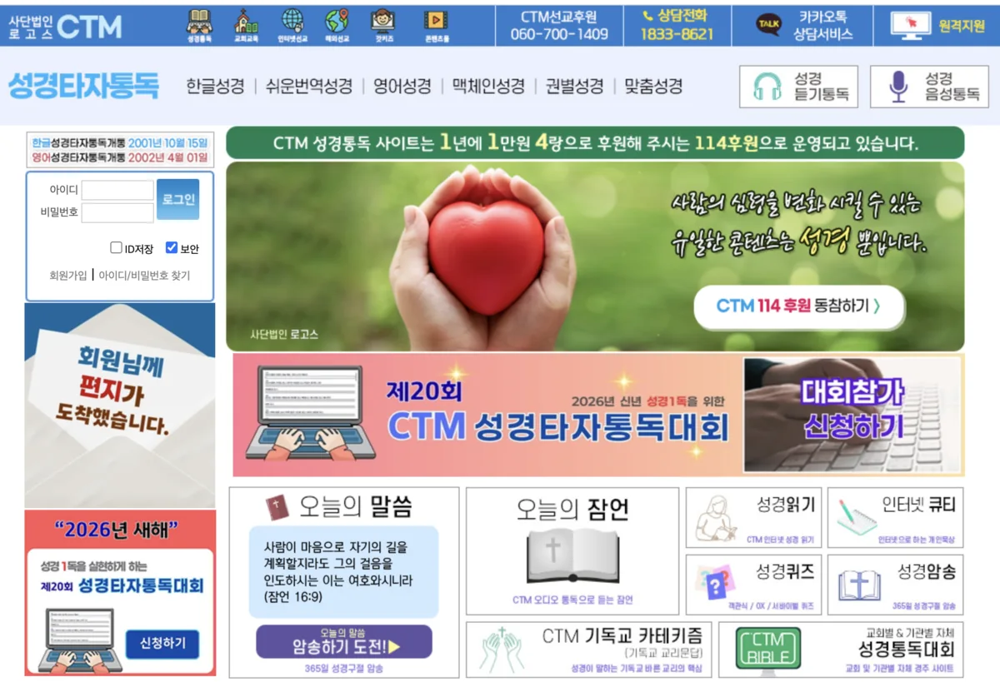
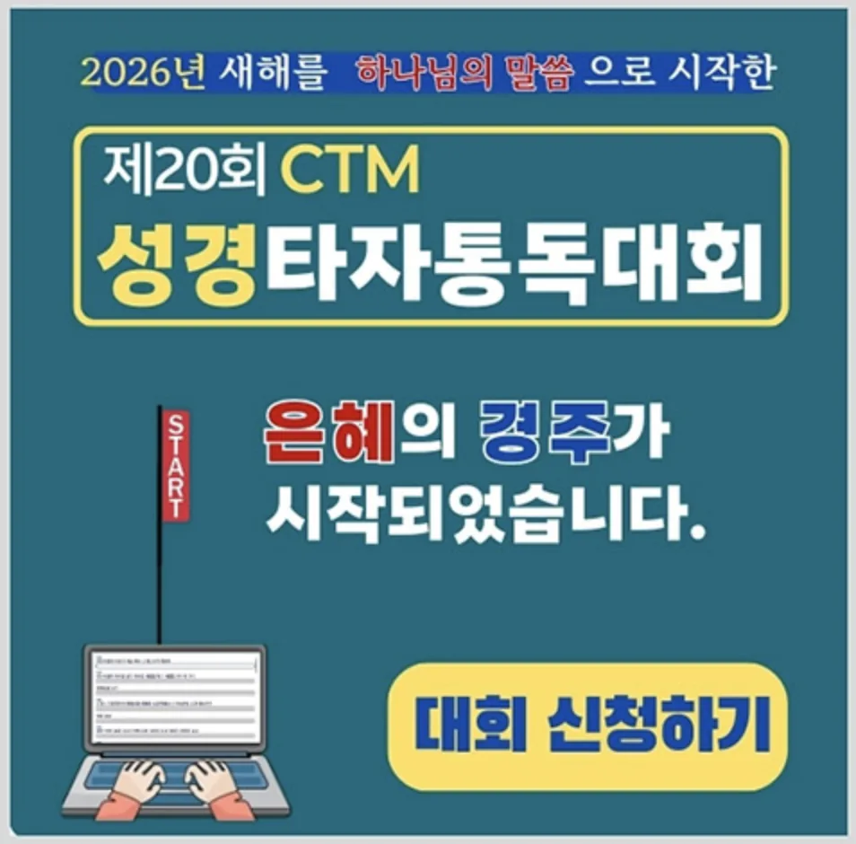
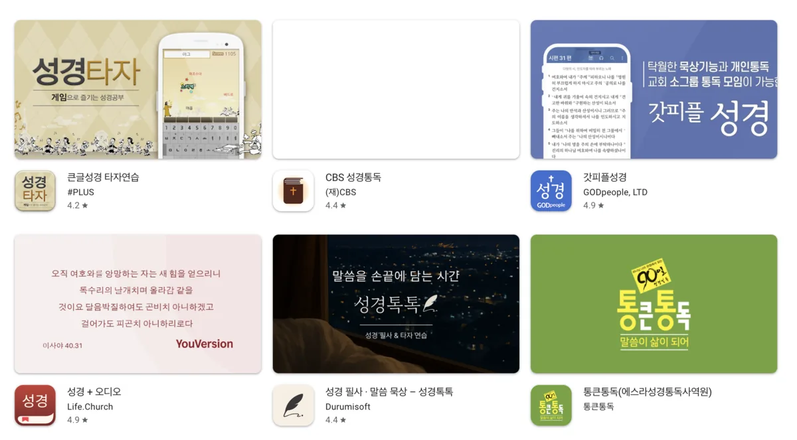
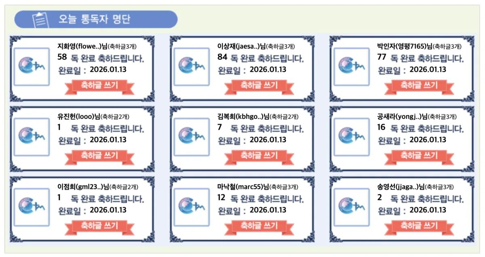

---

categories:

- 종교
- 기독교
  date: 2026-01-14T14:28:18+09:00
  description: CTM 성경타자통독 사이트 접속 방법, 회원가입, 한글/영어 성경통독, 맥체인 통독, 성경퀴즈까지 상세히 안내합니다.
  draft: false
  slug: ctm-seonggyeongtajatongdok-hompeiji-barogagi
  tags:
- CTM성경타자통독
- 성경통독
- 성경타자
- 맥체인통독
- 성경필사
- 성경읽기
- 기독교
  title: CTM 성경타자통독 홈페이지 바로가기 및 이용방법 완벽 가이드

cover:
  image: "thumbnail.webp"
  alt: ""
  hidden: false
---

## CTM 성경타자통독이란?

[성경타자통독 사이트 바로가기](https://bible.ctm.kr/)

CTM 성경타자통독은 사단법인 로고스 CTM(컴퓨터전문인선교회)에서 운영하는 온라인 성경 통독 서비스입니다. 성경을 단순히 읽는 것에서 나아가 직접 타자로 입력하면서 말씀을 묵상할 수 있도록 만들어진 플랫폼으로, 마치 성경 필사를 하는 것처럼 한 글자 한 글자 정성스럽게 말씀을 새길 수 있습니다.

CTM은 2007년부터 매년 **성경타자통독 대회**를 개최해 왔으며, 2026년 현재 20회를 맞이할 정도로 오랜 역사와 전통을 자랑합니다. 성경을 완독하면 명예의 전당에 이름을 올릴 수 있고, 통독 순위도 확인할 수 있어 꾸준히 말씀을 읽어나갈 수 있는 동기부여가 됩니다. 무료로 이용할 수 있으며, 컴퓨터 타자 연습과 성경 공부를 동시에 할 수 있어 많은 성도들에게 사랑받고 있습니다.

## CTM 성경타자통독 홈페이지 바로가기

CTM 성경타자통독 공식 홈페이지 주소는 **bible.ctm.kr** 입니다. 포털 사이트에서 'CTM 성경타자통독'을 검색하거나, 웹 브라우저 주소창에 직접 입력하여 접속할 수 있습니다.

홈페이지에 접속하면 메인 화면에서 다양한 성경 콘텐츠를 확인할 수 있습니다. 한글성경통독, 쉬운성경통독, 영어성경통독, 맥체인성경통독, 권별성경통독 등 여러 가지 통독 방식을 선택할 수 있으며, 성경퀴즈, 인터넷성경, 성경단어사전 등 부가 기능도 제공됩니다. PC뿐만 아니라 **모바일 웹**에서도 이용 가능하며, 스마트폰 앱으로도 다운로드하여 사용할 수 있습니다.

| 구분 | 주소 |

| --- | --- |

| 공식 홈페이지 | bible.ctm.kr |

| 한글성경통독 | bible.ctm.kr/korean |

| 영어성경통독 | bible.ctm.kr/english |

| 맥체인성경통독 | bible.ctm.kr/mac |

| 권별성경통독 | bible.ctm.kr/volume |

| 이용안내 | bible.ctm.kr/guide |

## 회원가입 방법

CTM 성경타자통독 서비스를 이용하기 위해서는 **회원가입이 필수**입니다. 가입 절차는 간단하며, 무료로 진행됩니다.

홈페이지 좌측 상단의 **회원가입** 메뉴를 클릭합니다. 이용약관과 개인정보 수집 동의에 체크한 후, 아이디, 비밀번호, 이름, 이메일 등 기본 정보를 입력합니다. 아이디와 비밀번호는 **영문과 숫자만 입력 가능**하니 참고하시기 바랍니다. 가입이 완료되면 바로 로그인하여 서비스를 이용할 수 있습니다. 하나의 계정으로 PC와 모바일에서 동일한 통독 진도를 이어갈 수 있어 편리합니다. 통독 진행 상황은 클라우드 방식으로 저장되어, 어느 기기에서든 이어서 진행할 수 있습니다.

## 성경타자통독 이용방법

회원가입과 로그인을 마쳤다면, 본격적으로 성경타자통독을 시작할 수 있습니다. 처음 이용하시는 분들을 위해 단계별로 안내해 드립니다.

**1단계**로 상단 메뉴에서 원하는 통독 유형을 선택합니다. 한글성경통독이 기본으로 선택되어 있으며, 쉬운성경, 영어성경, 맥체인성경, 권별성경 중에서 선택할 수 있습니다. **2단계**로 구약성경과 신약성경 66권 중에서 통독할 성경권을 선택합니다. 창세기부터 순서대로 진행해도 좋고, 원하는 성경권을 선택해도 됩니다. **3단계**로 선택한 성경권의 1장 1절부터 화면에 말씀이 표시되면, 아래 흰색 입력란에 **동일한 내용을 타자로 입력**합니다. 줄을 바꿀 때는 엔터(Enter) 키를 누르면 됩니다.

상단 보조 메뉴에서 글자 크기, 역본(개역한글, 개역개정, 새번역 등), 배경 등을 변경할 수 있습니다. 통독 중간에 **통독절수 저장하기** 버튼을 누르면 현재 진행 상황이 저장되어, 다음에 이어서 진행할 수 있습니다.

## 다양한 통독 유형 안내

CTM 성경타자통독은 사용자의 필요에 따라 다양한 통독 방식을 제공합니다. 각 유형의 특징을 파악하고 본인에게 맞는 방식을 선택하시기 바랍니다.

**한글성경통독**은 가장 기본적인 방식으로, 개역한글, 개역개정, 새번역 등 다양한 한글 역본을 선택하여 타자 통독을 할 수 있습니다. **쉬운성경통독**은 현대어로 쉽게 풀이된 쉬운성경 버전으로 통독하는 방식으로, 성경이 어렵게 느껴지는 분들에게 추천합니다. **영어성경통독**은 KJV, NIV, NKJV 등 영문 성경으로 타자 연습과 영어 공부를 함께 할 수 있습니다.

**맥체인성경통독**은 로버트 맥체인 목사가 고안한 1년 성경 읽기 표에 따라 매일 정해진 분량을 통독하는 방식입니다. 하루에 구약 2장, 신약 2장씩 읽어 1년에 신약 2번, 구약 1번을 완독하는 체계적인 통독 방법입니다. **권별성경통독**은 66권 중 원하는 성경권만 골라서 집중적으로 통독할 수 있습니다. **성경듣기통독**은 음성으로 성경을 들으며 묵상할 수 있는 기능입니다.

## 성경타자통독 대회 참가 안내

CTM에서는 매년 초 **성경타자통독 대회**를 개최하고 있습니다. 대회에 참가하면 목표 기간 내에 성경 통독을 완료해야 하므로, 꾸준히 말씀을 읽어나갈 수 있는 좋은 동기부여가 됩니다.

대회는 보통 **70일 종목, 120일 종목, 365일 종목** 등 기간별로 나뉘어 진행됩니다. 참가를 원하시면 대회 기간 중 홈페이지에서 통독 신청을 하고, 정해진 기간 내에 성경 66권 전체를 타자로 입력하여 완독하면 됩니다. 대회 참가 시에는 **한글개역개정** 역본을 선택해야 하며, 통독 시간은 24시간 제한 없이 자유롭게 진행할 수 있습니다. 완독에 성공하면 **명예의 전당**에 이름을 올릴 수 있고, 통독 순위와 통독 횟수도 기록됩니다. 1독, 2독, 3독 등 여러 번 통독에 도전하시는 분들도 많습니다.

## 성경퀴즈 및 부가 기능

CTM 성경타자통독 사이트에서는 타자 통독 외에도 다양한 성경 관련 콘텐츠를 이용할 수 있습니다. 성경을 조금 더 재미있게 공부하고 싶다면 활용해 보시기 바랍니다.

**성경퀴즈**는 창세기, 출애굽기, 마태복음 등 각 성경권별로 퀴즈를 풀어볼 수 있는 메뉴입니다. 비회원도 참여 가능하며, 성경 내용을 복습하고 기억을 되새기는 데 도움이 됩니다. **퍼즐성경퀴즈**는 십자말풀이 형식의 성경 퀴즈로, 가볍게 즐기면서 성경 단어를 익힐 수 있습니다. **성경단어사전**은 성경을 읽다가 모르는 단어가 나왔을 때 검색하면 해설과 해석을 확인할 수 있는 기능입니다. 통독 화면 우측 상단에서 바로 접근할 수 있어 편리합니다. **인터넷성경**은 성경 구절을 검색하고 읽을 수 있는 기능으로, 개역한글, 개역개정, KJV, NIV 등 다양한 역본을 지원합니다.

## 모바일 앱 다운로드 - CTM성경타자통독 이외의 앱들

[모바일 앱 다운로드 바로가기](https://play.google.com/store/search?q=ctm+%EC%84%B1%EA%B2%BD%ED%83%80%EC%9E%90%ED%86%B5%EB%8F%85&c=apps&hl=ko)

CTM 성경타자통독은 현재 별도의 공식 모바일 앱을 제공하지 않고 있습니다. 다만 **모바일 웹 브라우저**를 통해 bible.ctm.kr에 접속하면 스마트폰에서도 동일하게 타자통독 서비스를 이용할 수 있습니다. 모바일 웹에서도 PC와 동일한 계정으로 로그인하여 통독 진도를 이어갈 수 있으니 참고하시기 바랍니다.

스마트폰 앱 환경에서 성경타자를 이용하고 싶으신 분들은 유사한 기능을 제공하는 다른 앱들을 활용해 보실 수 있습니다. **CTS 성경타자**는 CTS기독교TV에서 제공하는 성경타자 서비스로, 구글 플레이스토어와 앱스토어에서 다운로드할 수 있습니다. **갓피플성경**은 다양한 역본의 성경 읽기와 필사 기능을 제공하며, **성경일독**과 같은 앱들도 체계적인 성경 통독을 도와줍니다. 각 앱마다 제공하는 기능과 역본이 다르므로 본인의 필요에 맞는 앱을 선택하여 사용하시면 됩니다.

CTM 성경타자통독의 최신 소식이나 모바일 서비스 관련 업데이트는 카카오톡 채널(@CTM성경타자통독)을 추가하거나 공식 홈페이지 공지사항을 통해 확인하실 수 있습니다.

## 마무리

CTM 성경타자통독은 성경 말씀을 타자로 직접 입력하면서 깊이 묵상할 수 있는 유익한 서비스입니다. 단순히 눈으로 읽는 것보다 손가락으로 한 글자 한 글자 입력하다 보면 말씀이 더욱 마음에 새겨지는 경험을 하실 수 있습니다. 컴퓨터 타자 연습과 성경 공부를 동시에 할 수 있어 일석이조의 효과가 있습니다.

처음 사용하시는 분들은 홈페이지의 **이용안내(bible.ctm.kr/guide)** 페이지에서 사용법, 메뉴 설명, 영상 매뉴얼, FAQ 등을 참고하시면 도움이 됩니다. 무료로 이용할 수 있으니, 올해 성경 1독을 목표로 CTM 성경타자통독에 도전해 보시기 바랍니다.

#CTM성경타자통독 #성경통독 #성경타자 #맥체인통독 #성경필사 #성경읽기 #말씀묵상
