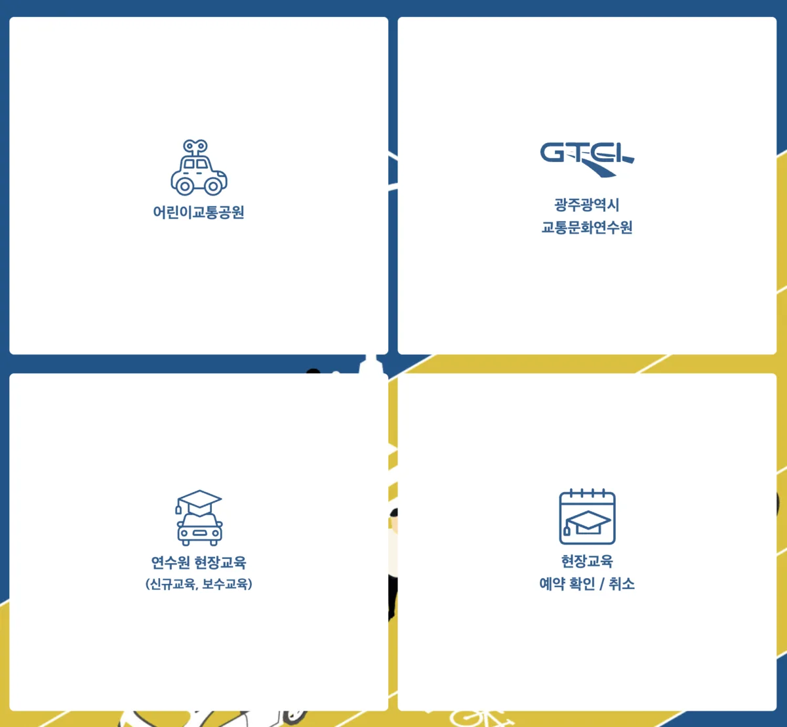
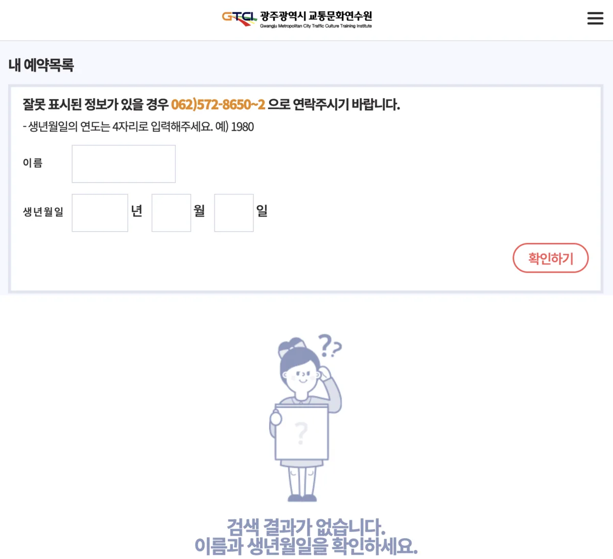

택시, 버스, 화물차량을 운행하는 운수종사자라면 매년 의무적으로 이수해야 하는 교육이 있습니다. 바로 **보수교육**입니다. 광주광역시에서 운수업에 종사하고 계신다면 광주광역시 교통문화연수원에서 진행하는 보수교육 일정을 미리 확인하고 신청해야 합니다.

보수교육을 이수하지 않으면 과태료가 부과될 수 있으므로 교육 대상자라면 반드시 기한 내에 교육을 완료해야 합니다. 이 글에서는 광주광역시 교통문화연수원의 보수교육 일정 확인 방법, 온라인 신청 절차, 교육 과정 안내, 연수원 위치 및 가는길, 주차장 정보까지 운수종사자분들께 필요한 모든 정보를 상세히 정리해 드리겠습니다.

[광주교통문화연수원 예약안내](https://www.gtci.or.kr/gtci/home/programs/education/listApply?menu=451)

## 광주광역시 교통문화연수원 기본 정보

광주광역시 교통문화연수원은 광주광역시 북구 일곡동에 위치한 운수종사자 교육 전문 기관입니다. 대지 21,571㎡, 건물 연면적 4,850.16㎡ 규모로 지하 1층, 지상 2층 건물에서 연간 약 20,000명의 운수종사자를 대상으로 교육을 실시하고 있습니다.

연수원의 주요 기능은 버스, 택시, 화물 등 업종별 운수종사자의 신규교육과 보수교육 실시, 법령위반 운수종사자 강화교육, 위험물질 운송차량 운전자 교육, 그리고 시민 대상 교통안전 교육 등입니다. 1층에는 대강당, 중강당, 컨벤션홀, 식당, 새암골 갤러리가 있으며, 2층에는 연수원 사무실과 교통약자이동지원센터가 위치해 있습니다.

## 보수교육 대상자 및 교육 주기

보수교육은 여객자동차운수사업법과 화물자동차운수사업법에 따라 운수종사자가 의무적으로 이수해야 하는 교육입니다. 개인택시, 법인택시, 시내버스, 마을버스, 전세버스 등 여객 운수종사자와 일반화물, 개별화물, 용달화물 등 화물 운수종사자가 교육 대상입니다.

교육 주기는 무사고·무법규위반 유지 기간에 따라 달라집니다. 무사고·무벌점 기간이 5년 미만인 경우에는 매년 교육을 이수해야 합니다. 5년 이상 10년 미만인 경우에는 2년에 1회, 10년 이상인 경우에는 3년에 1회 교육을 받으면 됩니다. 본인의 교육 면제 대상 여부는 연수원 홈페이지나 한국교통안전공단 등을 통해 조회할 수 있습니다.

보수교육을 이수하지 않으면 과태료가 부과됩니다. 1차 위반 시 20만 원, 위반 횟수가 증가할수록 과태료 금액도 올라가므로 교육 대상자라면 반드시 기한 내에 교육을 완료해야 합니다.

## 보수교육 과정 상세 안내

광주광역시 교통문화연수원의 보수교육은 2월부터 12월까지 연간 총 68회 진행됩니다. 여객업종 38회, 화물업종 22회, 위험물 2회, 통합 6회로 편성되어 있으며, 연간 약 18,700명이 교육을 이수합니다.

교육 시간은 **4시간**이며, 교육비는 광주광역시 소속 운수종사자의 경우 무료입니다. 다만 타 시도 화물업종 종사자가 광주에서 교육을 받을 경우에는 10,000원의 교육비가 부과됩니다.

여객업종 보수교육은 직무교육과 소양교육으로 나뉩니다. 직무교육에서는 개정 교통법규 및 교통안전 수칙, 교통사고 사례 분석 및 사고예방, 고객 만족을 위한 친절서비스 교육, 스쿨존 등 어린이 사고예방 집중교육을 다룹니다. 소양교육에서는 장애인 및 성인지 감수성(양성평등) 등 인권교육, 운전자의 스트레스 및 건강관리, 자동차 관리 및 친환경 경제운전에 대해 배웁니다.

화물업종 보수교육도 마찬가지로 직무교육과 소양교육으로 구성됩니다. 직무교육에서는 개정 교통법규, 교통사고 사례 분석, 불법개조 및 졸음운전 등 교통사고 원인 및 예방, 자동차 보험과 사고처리 등을 학습하며, 소양교육에서는 운전자 건강관리, 친환경 경제운전, 시정 홍보 및 주요 시책 안내 등을 다룹니다.

## 신규교육 및 법령위반자 강화교육 안내

보수교육 외에도 연수원에서는 신규교육과 법령위반 운수종사자 강화교육을 실시합니다.

**신규교육**은 여객자동차(택시, 버스 등)나 화물자동차에 새롭게 종사하게 된 운전자가 반드시 이수해야 하는 교육입니다. 교육 시간은 2일간 총 16시간(1일 8시간)이며, 현장 집합교육으로 진행됩니다. 2026년 1월 기준 가장 가까운 여객업종 신규교육 일정은 1월 13일부터 14일까지이며, 중강당에서 오전 9시부터 오후 6시까지 진행됩니다.

**법령위반 운수종사자 강화교육**은 여객자동차운수사업법 또는 화물자동차운수사업법을 위반하여 과태료, 과징금, 사업정지 처분을 받은 운수종사자와 중대사고 유발자(특별검사 대상자)가 이수해야 하는 교육입니다. 연 4회 분기별로 진행되며, 1일 8시간 교육입니다. 과태료, 과징금, 사업정지 처분을 받은 날로부터 3개월 이내에 교육을 이수해야 합니다. 교육비는 무료이나 식대는 교육생 본인이 부담합니다.

## 보수교육 온라인 신청방법 상세 안내

보수교육 신청은 광주광역시 교통문화연수원 공식 홈페이지(www.gtci.or.kr)를 통해 온라인으로 진행됩니다. 신청 절차는 다음과 같습니다.

먼저 연수원 홈페이지에 접속하여 메인 화면에서 **"연수원 현장교육(신규교육, 보수교육)"** 메뉴를 클릭합니다. 또는 상단 메뉴에서 "운수종사자 교육 → 교육신청"을 선택해도 됩니다. 교육 일정 선택 화면에서 본인이 종사하는 업종(여객/화물)에 맞는 교육 일정을 확인합니다. 2026년 1월부터 12월까지 월별로 교육 일정이 표시되며, 원하는 날짜의 교육을 선택하여 예약 버튼을 클릭합니다.

예약 신청 시에는 이름, 전화번호, 업종 선택, 차량 정보, 지역 정보 등 교육 관련 정보를 정확하게 입력해야 합니다. 입력한 개인정보는 교육 예약 및 수료 관련 업무에만 사용됩니다. 신청 완료 후에는 예약 확인 메뉴에서 본인의 예약 상태를 확인할 수 있습니다.

예약 확인 및 취소는 홈페이지의 **"현장교육 예약 확인/취소"** 메뉴에서 가능합니다. 다만 부득이한 사정으로 교육에 참석하지 못할 경우에는 가급적 빨리 예약을 취소하여 다른 교육생에게 기회를 양보하시기 바랍니다.

## 교육 당일 준비물 및 유의사항

교육 당일에는 **신분증과 운전면허증**을 반드시 지참해야 합니다. 화물 운송 종사자의 경우 화물운송종사자격증도 함께 준비하는 것이 좋습니다. 연수원 본관 1층 접수처에서 신분 확인 후 교육장으로 입장하게 됩니다.

교육은 보통 오전부터 오후까지 4시간 동안 진행되므로 점심 식사 해결이 필요합니다. 연수원 건물 1층에 **식당**이 마련되어 있어 교육생들이 이용할 수 있습니다. 식당 외에도 연수원 주변에 음식점들이 있으니 외부 식사도 가능합니다. 다만 법령위반자 강화교육(8시간)의 경우 식대는 교육생 본인 부담이니 참고하시기 바랍니다.

교육 시간을 준수하는 것이 매우 중요합니다. 지각하거나 조퇴할 경우 교육 이수가 인정되지 않을 수 있으므로 여유 있게 도착하시기 바랍니다.

## 광주광역시 교통문화연수원 위치 및 가는길

광주광역시 교통문화연수원의 주소는 광주광역시 북구 모룡대길 68(일곡동 490)입니다. 연락처는 062-572-8650~2이며, 팩스번호는 062-572-8658입니다.

**대중교통**을 이용할 경우 "살레시오고/교통문화연수원" 버스 정류장에서 하차하면 됩니다. 해당 정류장을 경유하는 버스 노선은 송정29, 일곡10, 일곡28, 일곡38, 진월07, 금남57, 첨단193, 419번 등이 있습니다. 정류장에서 연수원까지는 도보로 약 10분 정도 소요됩니다. 또한 본촌현대아파트 정류장에서 하차 후 도보로 이동하는 방법도 있습니다.

**자가용**으로 방문할 경우 네비게이션에 "광주광역시 교통문화연수원" 또는 "광주광역시 북구 모룡대길 68"을 검색하여 안내받으시면 됩니다. 연수원 부지 내에 주차장이 마련되어 있어 교육생들이 무료로 이용할 수 있습니다. 다만 교육 일정에 따라 주차 공간이 부족할 수 있으니 가급적 대중교통 이용을 권장합니다.

## 교육 이수 확인 및 수료증 발급

교육을 이수한 후에는 연수원 홈페이지에서 **교육 이수 확인**이 가능합니다. 홈페이지 메인 화면 또는 "운수종사자 교육 → 교육 이수 확인" 메뉴에서 본인 인증 후 교육 이수 내역을 조회할 수 있습니다.

교육 수료 후에는 수료증이 발급되며, 이는 향후 운수종사자 자격 유지 및 관련 행정 처리 시 필요한 서류로 활용됩니다. 교육 이수 기록은 연수원과 관계 기관에 자동으로 전산 등록되므로 별도로 수료증을 제출하지 않아도 되는 경우가 많지만, 필요시 홈페이지에서 출력하거나 연수원에 요청하여 발급받을 수 있습니다.

## 마무리

광주광역시 교통문화연수원의 보수교육은 운수종사자로서 안전운전 의식을 재점검하고 최신 교통법규와 서비스 마인드를 함양하는 중요한 기회입니다. 매년 또는 본인의 무사고 기간에 따라 정해진 주기에 맞춰 교육을 이수해야 하며, 미이수 시 과태료가 부과되므로 교육 일정을 미리 확인하고 신청하시기 바랍니다.

연수원 홈페이지에서 실시간으로 교육 일정과 잔여 인원을 확인할 수 있으니, 원하는 날짜에 교육을 받으려면 서둘러 예약하는 것이 좋습니다. 교육 당일에는 신분증과 운전면허증을 꼭 지참하시고, 시간 여유를 두고 방문하시어 안전하고 유익한 교육 시간 되시길 바랍니다.

#광주교통문화연수원 #운수종사자보수교육 #택시보수교육 #버스보수교육 #화물보수교육 #광주운수종사자교육 #신규교육 #법령위반교육 #교통연수원 #광주북구
