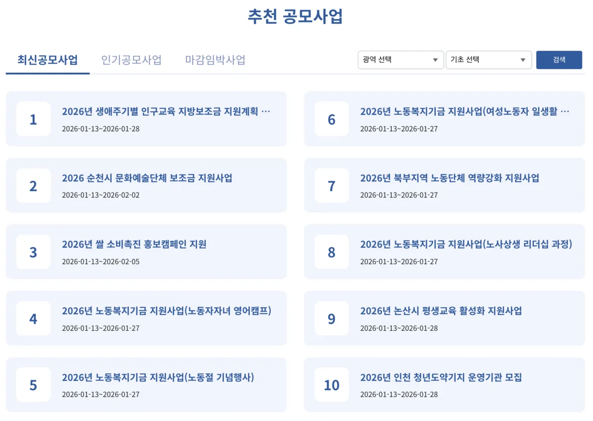
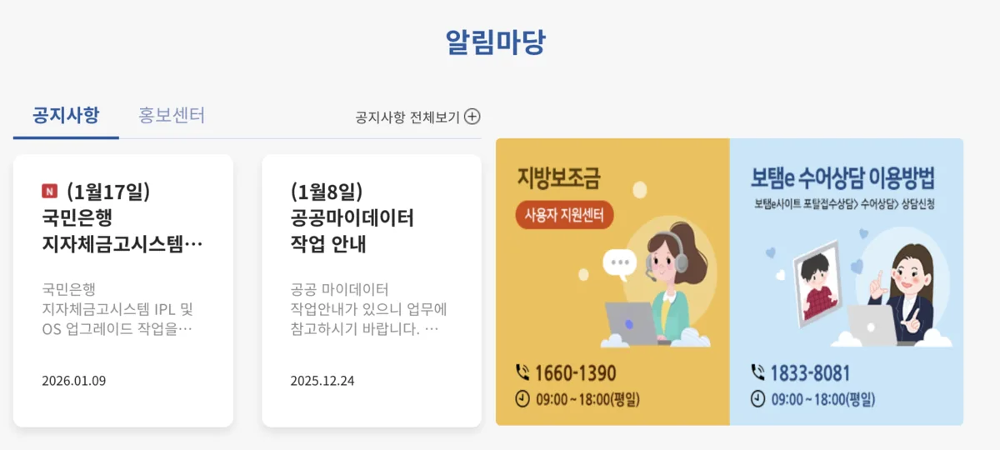

지방자치단체로부터 보조금을 지원받아 사업을 수행하는 민간단체나 기업이라면 반드시 알아야 할 시스템이 있습니다. 바로 보탬e(지방보조금관리시스템)입니다. 보탬e는 지방보조금의 신청부터 교부, 집행, 정산, 사후관리까지 전 과정을 온라인으로 처리하는 통합 플랫폼으로, 2023년 1월부터 본격 운영되고 있습니다.

보탬e라는 이름은 '보태어 도와준다'는 의미에 전자시스템을 뜻하는 'e'를 결합한 것으로, 지방보조금을 통해 국민 생활에 보탬이 되겠다는 의미를 담고 있습니다. 이 글에서는 보탬e의 고객센터 전화번호, 홈페이지 접속 방법, 주요 기능, 그리고 민간보조사업자가 알아야 할 사용 방법까지 상세히 안내해 드리겠습니다.

## 보탬e 고객센터 전화번호 및 운영시간

보탬e 사용 중 문의사항이 있다면 **고객상담센터(1660-1390)**로 연락하시면 됩니다. 운영시간은 평일 오전 9시부터 오후 6시까지이며, 점심시간(12:00~13:00)과 공휴일에는 전화 연결이 제한됩니다.

전화 연결 후에는 ARS 안내에 따라 업무별 번호를 선택하면 해당 담당자와 연결됩니다. 업무별 ARS 번호는 다음과 같습니다. 공모 보조사업 신청 문의는 1번, 교부신청 및 사업수행계획 문의는 2번, 집행 및 이체, 계약 문의는 3번, 정산 및 공시, 중요재산 문의는 4번, 사용자지원 및 금융관리 문의는 5번, 대민포털 및 통계 문의는 6번을 누르시면 됩니다.

2025년 8월부터는 **실시간 채팅 상담 서비스**도 운영되고 있어, 전화 연결이 어려운 경우 보탬e 홈페이지 내 채팅 기능을 통해 문의할 수 있습니다. 채팅 상담은 간단한 문의사항을 빠르게 해결하는 데 유용합니다.

## 보탬e 홈페이지 및 관련 사이트 안내

보탬e와 관련된 주요 사이트 주소를 정리해 드립니다.

**보탬e 업무시스템**([www.losims.go.kr)은](http://www.losims.go.kr)%EC%9D%80) 민간보조사업자와 공무원이 실제로 보조금 업무를 처리하는 메인 시스템입니다. 회원가입, 공모신청, 교부신청, 집행등록, 정산 등 모든 업무가 이 사이트에서 이루어집니다.

**보탬e 온라인 교육시스템**([www.losims-edu.com)은](http://www.losims-edu.com)%EC%9D%80) 보탬e 사용 방법을 배울 수 있는 교육 플랫폼입니다. 온라인 교육, 상설(실습) 교육, 비대면(화상) 교육 등 다양한 교육 과정을 신청할 수 있으며, 교육 수료 후 수료증도 발급받을 수 있습니다.

**보조금통합포털**([www.bojo.go.kr)은](http://www.bojo.go.kr)%EC%9D%80) 국고보조금(e나라도움)과 지방보조금(보탬e) 정보를 통합적으로 제공하는 포털 사이트입니다. 보조사업 공고 조회, 부정수급 제보, 보조사업자 정보공시 조회 등이 가능합니다.

**유튜브 채널 '보탬e'**에서는 시스템 사용 방법에 대한 영상 강좌를 제공하고 있어, 처음 시스템을 이용하는 분들이 참고하기 좋습니다.

## 보탬e와 e나라도움의 차이점

보조금 관리시스템을 처음 접하는 분들이 가장 헷갈려하는 부분이 보탬e와 e나라도움의 차이입니다. 두 시스템은 모두 보조금을 관리하는 전자시스템이지만, 보조금의 재원에 따라 사용하는 시스템이 다릅니다.

**e나라도움**([www.gosims.go.kr)은](http://www.gosims.go.kr)%EC%9D%80) **국고보조금**을 관리하는 시스템입니다. 중앙부처(정부)에서 지급하는 보조금을 받아 사업을 수행할 때 사용합니다. 고객센터 전화번호는 1670-9595입니다.

**보탬e**([www.losims.go.kr)는](http://www.losims.go.kr)%EB%8A%94) **지방보조금**을 관리하는 시스템입니다. 광역시·도, 시·군·구 등 지방자치단체에서 지급하는 보조금을 받아 사업을 수행할 때 사용합니다. 고객센터 전화번호는 1660-1390입니다.

따라서 본인이 수행하는 보조사업의 재원이 국비인지 지방비인지에 따라 사용해야 할 시스템이 달라집니다. 만약 국비와 지방비가 혼합된 사업이라면 두 시스템을 모두 사용해야 할 수도 있습니다.

## 보탬e 회원가입 및 로그인 방법

보탬e를 이용하려면 먼저 회원가입이 필요합니다. 보탬e 업무시스템([www.losims.go.kr)에](http://www.losims.go.kr)%EC%97%90) 접속하여 회원가입 절차를 진행합니다.

회원가입 시에는 본인 인증이 필요하며, 휴대전화 인증 또는 공동인증서(구 공인인증서)를 통해 본인 확인을 진행합니다. 가입 시 성명, 생년월일, 연락처, 이메일 등 기본 정보를 입력하고, 소속 자치단체와 거주지 주소 등의 추가 정보를 입력해야 합니다.

회원가입이 완료되면 소속 단체의 단체정보관리자가 구성원 승인을 해주어야 시스템 이용이 가능합니다. 단체정보관리자는 가입된 구성원을 확인하고 민간보조사업자로 지정하는 역할을 합니다. 민간보조사업자로 지정되어야 보조금 교부신청, 집행등록, 정산 등의 업무를 수행할 수 있습니다.

## 주요 기능 및 업무 흐름

보탬e에서 민간보조사업자가 수행하는 주요 업무는 공모신청, 교부신청, 집행관리, 정산관리, 정보공시 등입니다.

**공모신청**은 지방자치단체에서 공고한 보조사업에 신청하는 단계입니다. 보탬e 또는 보조금통합포털에서 공모 중인 사업을 조회하고, 신청서와 사업계획서 등 필요 서류를 온라인으로 제출합니다.

**교부신청**은 보조사업자로 선정된 후 보조금을 교부받기 위해 신청하는 단계입니다. 사업수행계획서를 작성하고, 보조금 전용 계좌와 카드를 등록한 후 교부신청서를 제출합니다. 보조금 전용카드는 대표자 명의 또는 사업자 명의로 금융기관에서 발급받아 시스템에 등록해야 합니다.

**집행관리**는 교부받은 보조금을 실제로 사용하는 단계입니다. 보조금 전용카드로 결제한 내역이나 계좌이체 내역을 시스템에 등록하고, 증빙서류(영수증, 거래명세서, 물품검수 사진 등)를 첨부합니다. 집행정보 등록 후 이체담당자의 승인을 거쳐 집행이 완료됩니다.

**정산관리**는 보조사업 종료 후 집행 내역을 정리하여 보고하는 단계입니다. 집행실적보고서를 작성하고, 잔액이 있는 경우 반납 처리를 합니다. 보조금 3억 원 이상인 경우 감사보고서, 10억 원 이상인 경우 회계감사보고서가 필요합니다.

**정보공시**는 보조사업 수행 내역을 대국민에게 공개하는 단계입니다. 보조금 사용 내역, 사업 성과 등을 투명하게 공시하여 보조금 운영의 투명성을 높입니다.

## 보탬e 온라인 교육 안내

보탬e 사용이 처음이거나 사용 방법이 어려운 경우 온라인 교육을 통해 학습할 수 있습니다. 보탬e 온라인 교육시스템([www.losims-edu.com)에서](http://www.losims-edu.com)%EC%97%90%EC%84%9C) 다양한 교육 과정을 제공하고 있습니다.

**온라인 교육**은 사전 녹화된 영상을 통해 언제든지 수강할 수 있는 과정입니다. 회원가입, 공모신청, 교부신청, 집행관리, 정산관리 등 업무 단계별로 교육 영상이 제공됩니다.

**상설(실습) 교육**은 전산실에서 직접 시스템을 조작해보며 배우는 현장 실습 교육입니다. 서울, 세종 등에 마련된 교육장에서 진행되며, 홈페이지에서 일정을 확인하고 신청할 수 있습니다.

**비대면(화상) 교육**은 ZOOM 등 화상회의 프로그램을 통해 실시간으로 진행되는 교육입니다. 예치형 신청교부과정, 집행과정, 정산과정 등 주제별로 교육이 진행되며, 교육 일정에 맞춰 신청하면 됩니다.

교육 수료 후에는 나의 강의실 메뉴에서 수료증을 출력할 수 있습니다.

## 보탬e 이용 시 유의사항

보탬e를 원활하게 이용하기 위해 몇 가지 유의사항을 안내드립니다.

보조금 전용카드와 전용계좌는 반드시 보조사업에만 사용해야 합니다. 개인 용도로 사용하거나 다른 사업에 혼용하면 부정수급으로 간주될 수 있습니다. 카드 사용 내역과 계좌 이체 내역은 모두 시스템에 자동으로 연동되어 관리됩니다.

집행등록 시 증빙서류를 빠짐없이 첨부해야 합니다. 카드영수증, 거래명세서, 세금계산서, 물품검수 사진 등 거래 내역을 증명할 수 있는 서류를 준비하여 업로드해야 정산 시 문제가 발생하지 않습니다.

보조사업 기간 내에 집행을 완료하고 기한 내에 정산보고서를 제출해야 합니다. 기한을 초과하면 보조금 반환 명령이나 향후 보조사업 참여 제한 등 불이익이 발생할 수 있습니다.

시스템 사용 중 오류가 발생하거나 사용 방법을 모르는 경우에는 고객센터(1660-1390)로 문의하거나 온라인 교육을 통해 해결하시기 바랍니다.

## 마무리

보탬e는 지방보조금의 투명하고 효율적인 관리를 위해 마련된 필수 시스템입니다. 지방자치단체로부터 보조금을 지원받아 사업을 수행하는 민간단체, 비영리법인, 기업 등은 반드시 보탬e를 통해 보조금 업무를 처리해야 합니다.

시스템 사용이 익숙하지 않은 분들은 온라인 교육시스템([www.losims-edu.com)](http://www.losims-edu.com)%EC%97%90%EC%84%9C) 제공하는 교육 영상을 먼저 시청하시고, 궁금한 점은 고객센터(1660-1390)로 문의하시기 바랍니다. 보탬e를 통해 보조금을 투명하게 관리하고, 사업을 성공적으로 수행하시길 바랍니다.

#보탬e #지방보조금 #보조금관리시스템 #민간보조사업자 #보조금집행 #보조금정산 #e나라도움 #보조금통합포털 #지방자치단체 #보조사업
