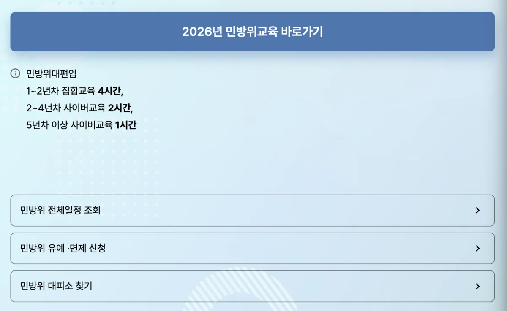
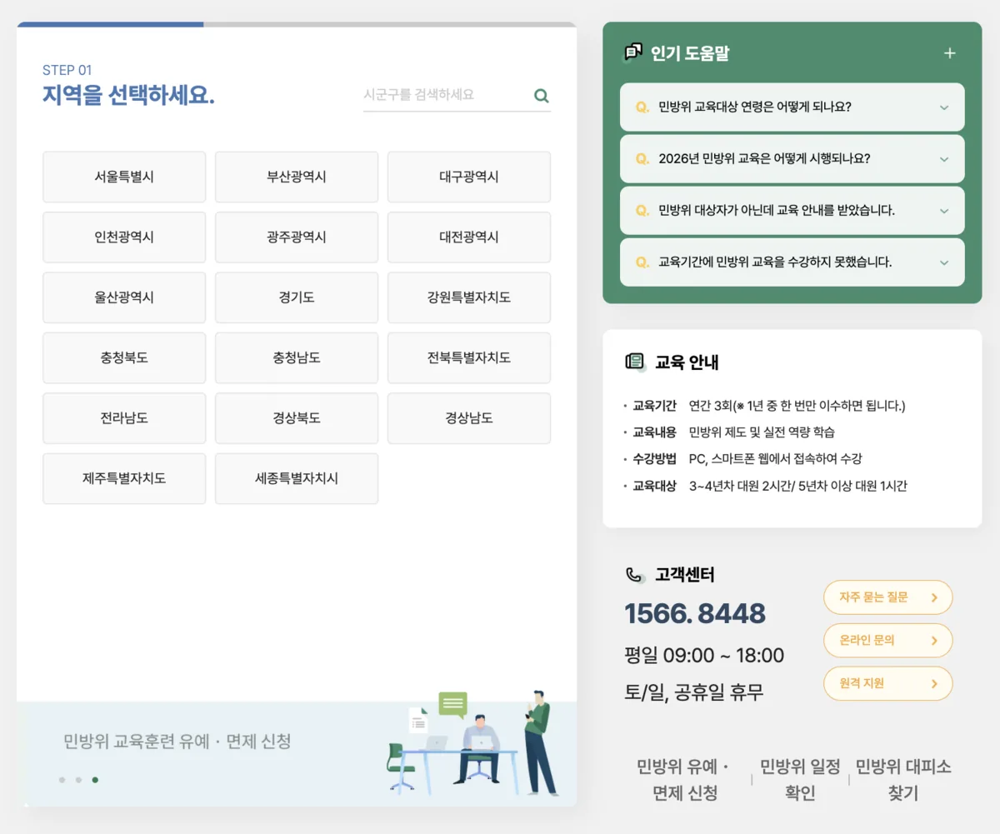
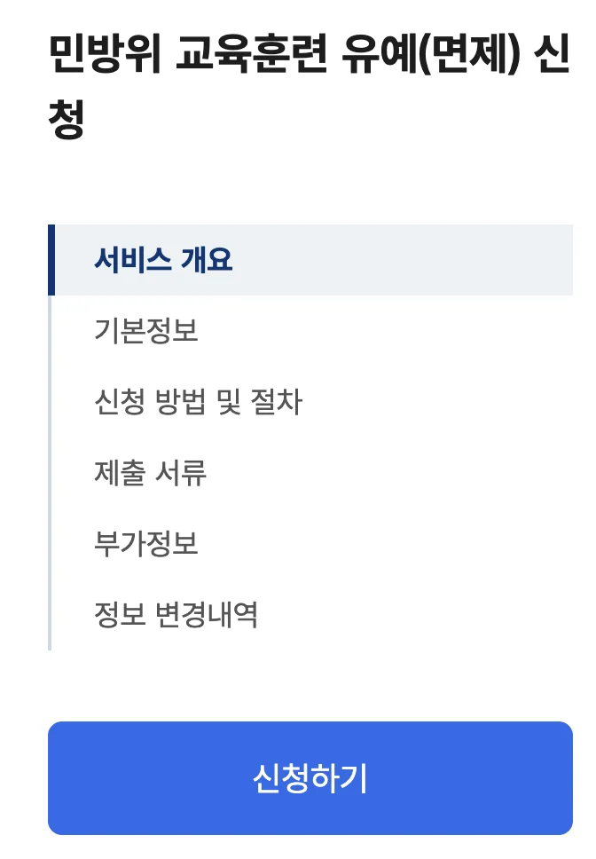

매년 돌아오는 민방위 교육, 막상 받으려면 어디서 일정을 확인하고 어떻게 신청해야 하는지 헷갈리는 분들이 많습니다. 특히 1~2년차 대원은 반드시 집합교육에 참석해야 하기 때문에 미리 일정을 파악해두는 것이 중요합니다. 교육에 불참하면 과태료가 부과되므로 꼼꼼히 챙겨야 할 부분이죠.

이번 글에서는 2026년 민방위 집합교육의 대상자 확인 방법부터 일정 조회, 교육 신청 절차, 당일 준비물, 그리고 교육 이수 후 이수증을 발급받는 방법까지 상세하게 안내해 드리겠습니다.

[민방위 교육 홈페이지 바로가기](https://www.cmes.or.kr/)

[민방위 교육훈련 유예(면제) 신청 ](https://www.gov.kr/mw/AA020InfoCappView.do?HighCtgCD=A01002&CappBizCD=16600000011&tp_seq=01)

## 민방위 교육 대상자와 연차별 교육 방식

민방위 대원은 만 20세 이상 만 40세 이하의 대한민국 국민 중 현역·예비역 복무를 마친 사람이 해당됩니다. 군 전역 후 8년간 예비군 훈련을 마치면 그 다음 해부터 민방위 대원으로 편성되어 교육을 받게 됩니다.

2026년 기준 민방위 교육은 연차에 따라 교육 방식과 시간이 다르게 운영됩니다. **1~2년차 대원**은 집합교육 4시간을 이수해야 합니다. 직접 지정된 교육장에 방문하여 대면으로 교육을 받는 방식입니다. **3~4년차 대원**은 사이버교육 2시간으로 대체되며, **5년차 이상 대원**은 사이버교육 1시간만 이수하면 됩니다. 사이버교육은 온라인으로 진행되기 때문에 시간과 장소에 구애받지 않고 편리하게 수강할 수 있습니다.

본인의 민방위 연차를 모르는 경우 국민재난안전포털이나 민방위 전자출결센터에서 이름과 생년월일만 입력하면 간단하게 조회할 수 있습니다.

## 민방위 집합교육 일정 조회 방법

민방위 집합교육 일정은 **국민재난안전포털(safekorea.go.kr)**에서 전국 지역별로 조회할 수 있습니다. 포털에 접속한 뒤 '민방위' 메뉴에서 '교육일정'을 선택하면 지역, 교육 대상, 교육 일시, 교육 장소 정보를 확인할 수 있습니다. 조회 기간은 최대 3개월까지 가능하며, 원하는 지역의 행정동을 선택하여 세부 일정을 검색하면 됩니다.

민방위 교육의 큰 장점 중 하나는 **전국 어디서나 교육을 받을 수 있다**는 점입니다. 주민등록상 주소지가 아니더라도 현재 거주하는 지역이나 직장 인근 지역에서 교육을 이수할 수 있습니다. 예를 들어 서울에 주소를 두고 있지만 경기도에서 근무하는 경우, 경기도 지역의 교육 일정을 조회하여 참석하면 됩니다. 별도의 변경 신청 없이 신분증만 지참하고 원하는 일정에 참석하면 됩니다.

또한 **민방위 전자통지서**를 통해서도 본인에게 배정된 교육 일정을 확인할 수 있습니다. 전자통지서는 카카오톡이나 문자 메시지로 순차적으로 발송되며, 통지서에 기재된 일정에 참석이 어려운 경우 다른 일정을 선택하여 참석하면 됩니다.

## 민방위 집합교육 신청 및 참석 절차

민방위 집합교육은 별도의 사전 신청 절차가 필요하지 않습니다. 국민재난안전포털이나 전자통지서를 통해 교육 일정을 확인한 뒤, 교육 당일 지정된 교육장에 직접 방문하면 됩니다.

**준비물**은 신분증과 스마트폰 두 가지입니다. 신분증은 주민등록증, 운전면허증, 여권 등 본인 확인이 가능한 공식 신분증이면 됩니다. 모바일 운전면허증(PASS 앱)도 인정되는 경우가 있으나, 교육장에 따라 다를 수 있으므로 실물 신분증을 지참하는 것이 안전합니다. 스마트폰은 현장에서 QR코드를 통한 전자출결 처리에 필요합니다.

**복장**은 평상복으로 참석하면 됩니다. 과거에는 군복 착용을 요구하기도 했으나 현재는 간소복 착용이 원칙입니다. 교육장에 따라 주차 공간이 협소하거나 아예 주차가 불가능한 경우가 많으므로 대중교통을 이용하는 것을 권장합니다.

교육장에 도착하면 입구에서 대형 화면에 표시된 QR코드를 스마트폰으로 스캔하여 출석 체크를 합니다. 이후 4시간 동안 민방위 관련 교육을 이수하고, 교육 종료 시 다시 QR코드를 스캔하여 퇴실 처리를 하면 교육이 완료됩니다.

## 민방위 교육 이수증 발급 방법

교육을 이수한 후에는 이수증을 발급받아 회사나 기관에 제출해야 하는 경우가 있습니다. 민방위 교육 이수증은 **민방위 전자출결센터(ktongji.or.kr)** 또는 각 지역별 민방위 교육 사이트에서 발급받을 수 있습니다.

이수증 발급 절차는 다음과 같습니다. 먼저 민방위 전자출결센터에 접속하여 본인이 교육을 받은 지역을 선택합니다. 지역 선택 후 이름, 생년월일 등 본인 정보를 입력하여 로그인합니다. 로그인 후 메뉴에서 '교육 이수증' 항목을 클릭하면 이수 번호, 연차, 성명, 교육 이수 일자 등이 기재된 이수증 화면이 나타납니다. 화면 하단의 '파일로 저장하기' 버튼을 클릭하면 PNG 이미지 파일 형태로 이수증이 다운로드됩니다.

사이버교육을 이수한 경우에도 동일한 방식으로 이수증을 발급받을 수 있습니다. 다만 각 지역마다 운영하는 사이버교육 사이트가 다르기 때문에 본인이 교육을 이수한 사이트에서 이수증을 발급받아야 합니다. 이수증은 해당 연도 12월 31일까지 웹사이트에서 출력이 가능하므로, 필요한 경우 미리 저장해두는 것이 좋습니다.

## 교육 불참 시 과태료와 주의사항

[민방위 대피소 위치 안내](http://www.safekorea.go.kr/idsiSFK/neo/sfk/cs/contents/civil_defense/SDIJKM1402.html?menuSeq=57)

민방위 교육은 법적 의무이기 때문에 정당한 사유 없이 불참할 경우 과태료가 부과됩니다. 기본 교육에 불참하더라도 보충 교육 기회가 주어지는데, 보충 교육까지 모두 불참하면 **10만 원의 과태료**가 부과됩니다. 과태료를 납부하더라도 연차는 올라가지 않고 그대로 유지되어 다음 해에 동일한 교육을 다시 받아야 합니다.

교육에 참석하기 어려운 사정이 있는 경우 유예 또는 면제 신청을 할 수 있습니다. 해외 체류, 질병, 수형 중인 경우 등 민방위기본법에서 정한 사유에 해당하면 정부24(gov.kr)를 통해 온라인으로 유예·면제 신청이 가능합니다. 대학생의 경우에도 학업 사유로 면제 신청을 할 수 있으니, 해당되는 분들은 미리 신청해두시기 바랍니다.

민방위 교육 일정은 보통 3월부터 시작하여 11월까지 진행되며, 보충 교육을 포함하면 12월까지 운영됩니다. 연말에 급하게 교육을 받으려 하면 일정이 마감되거나 선택의 폭이 좁아질 수 있으므로, 가능하면 상반기 중에 미리 이수해두는 것을 권장합니다.

## 마무리

민방위 집합교육은 복잡해 보이지만 실제로는 국민재난안전포털에서 일정을 조회하고, 신분증과 스마트폰만 챙겨서 참석하면 되는 간단한 과정입니다. 전국 어디서나 교육을 받을 수 있고, 별도의 신청 절차도 필요 없어 본인 일정에 맞춰 유연하게 참여할 수 있습니다. 교육 이수 후에는 전자출결센터에서 이수증을 바로 발급받을 수 있으니, 필요한 분들은 미리 다운로드해두시기 바랍니다.

올해 민방위 교육 대상이시라면 국민재난안전포털에서 일정을 확인하고, 잊지 말고 교육에 참석하여 불필요한 과태료 부담 없이 깔끔하게 마무리하시길 바랍니다.

#민방위 #민방위교육 #집합교육 #민방위일정조회 #이수증발급 #전자출결센터 #국민재난안전포털
