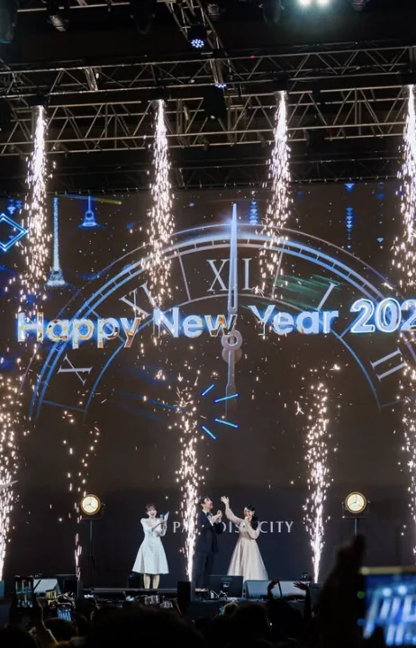

파라다이스시티는 인천 영종도에 위치한 대규모 복합 리조트로 호텔, 카지노, 다이닝, 스파 등 다양한 시설을 갖추고 있습니다. 객실 예약부터 시설 이용, 멤버십 관련 사항까지 궁금한 점들이 많을 때 어디로 연락해야 할지 모르면 불편함이 발생합니다. 이 글에서는 파라다이스시티의 모든 문의처를 정리하여 상황별로 가장 빠르고 효율적인 상담을 받을 수 있는 방법을 상세히 안내하겠습니다.

[파라다이스시트 인스타그램](https://www.instagram.com/pcitykorea/)
[네이버지도에서보기](https://map.naver.com/p/search/%ED%8C%8C%EB%9D%BC%EB%8B%A4%EC%9D%B4%EC%8A%A4%EC%8B%9C%ED%8B%B0/place/304210835?c=15.00,0,0,0,dh&placePath=%3Fbk_query%253D%2525ED%25258C%25258C%2525EB%25259D%2525BC%2525EB%25258B%2525A4%2525EC%25259D%2525B4%2525EC%25258A%2525A4%2525EC%25258B%25259C%2525ED%25258B%2525B0%2526entry%253Dbmp)

---

## 파라다이스시티 대표 전화번호 및 운영시간

파라다이스시티의 모든 문의를 총괄하는 **공식 대표 전화번호는 1833-8855**입니다. 이 번호를 통해 객실 예약, 예약 확인, 취소, 각종 시설 안내 등 리조트 전반에 걸친 문의를 처리할 수 있습니다.

**대표번호 운영시간 및 특징**

예약 관련 상담은 일반적으로 오전 9시부터 오후 6시까지 집중적으로 운영되며, 예약 확인이나 변경 같은 주요 업무도 이 시간대에 처리하는 것이 가장 효율적입니다. 다만 리조트 현장의 프론트 데스크와 연결되는 상담은 **24시간 대응이 가능**한 구조로 되어 있습니다. 따라서 늦은 밤에 방문 일정이 변경되거나 긴급한 문의가 생겼을 때도 대표번호를 통해 상황을 전달하고 도움을 받을 수 있습니다.

**추가 연락처 안내**

이메일 주소는 **p-city@paradian.com**이며, 팩스번호는 **032-729-2100**입니다. 서면 문의가 필요한 경우 이 연락처를 사용하면 됩니다.

---

## 시설별 전문 전화번호

파라다이스시티 내 각 시설마다 **전담 상담 부서가 운영**되고 있어서, 특정 시설에 대한 구체적인 문의가 있다면 해당 부서로 직접 연락하면 더 빠른 응대를 받을 수 있습니다.

**호텔 및 숙박 관련 문의**

호텔 및 리조트 예약은 대표번호 **1833-8855** 또는 **032-729-2000**으로 문의하면 됩니다. 객실 예약, 패키지 상품, 숙박 관련 모든 문의를 이 번호로 처리할 수 있습니다.

**카지노 관련 문의**

파라다이스 카지노 관련 사항은 **032-729-3000**으로 연락하면 됩니다. 카지노 내 특정 게임이나 이벤트에 관한 자세한 사항은 **032-729-3121~3124**로 문의할 수 있습니다.

**웰니스 및 여가시설**

씨메르(CIMER) 스파는 **032-729-7700**으로 문의하고, 크로마(CHROMA) 클럽은 **032-729-7600~7602**로 예약 및 문의가 가능합니다. 원더박스(WONDERBOX) 멤버십 관련 사항은 **032-729-7500**으로 문의하면 됩니다.

**문화 및 쇼핑시설**

아트 파라디소(ART PARADISO) 갤러리는 **032-729-5116**에 전화하면 되며, 플라자(PLAZA) 쇼핑은 대표번호 **1833-8855**를 사용하면 됩니다. 아트 스페이스(PARADISE ART SPACE)는 **1833-8880**으로 문의할 수 있습니다.

이렇게 시설별로 전문화된 번호를 사용하면 **대기 시간을 크게 줄이고 정확한 정보**를 빠르게 받을 수 있습니다.

---

## 자동응답 시스템을 통한 빠른 상담 연결

대표번호 1833-8855로 전화를 걸면 **자동 응답 시스템의 안내**가 시작됩니다. 이 시스템을 잘 활용하면 대기 없이 원하는 부서로 직접 연결될 수 있습니다.

**자동응답 시스템의 메뉴 구성**

자동 응답 시스템에서는 일반적으로 **1번은 객실 예약 및 패키지 문의**, **2번은 씨메르나 원더박스 같은 부대시설 안내**, **3번은 멤버십 관련 문의** 등으로 구분되어 있습니다. 본인이 원하는 문의 분야에 맞춰 **숫자를 입력하면 해당 담당 상담원과 빠르게 연결**됩니다.

**효율적인 시스템 활용법**

시설 이용 요금, 패키지 상세 정보, 특별한 요청사항 등 각 카테고리에 맞는 번호를 선택하는 것이 **대기 시간을 줄이는 비결**입니다. 만약 어느 번호를 눌러야 할지 불확실하다면 0번을 누르면 **상담원이 직접 나와 고객의 문의 내용을 파악한 후 적절한 부서로 연결**해주므로 참고하시기 바랍니다. 이렇게 하면 처음에 원하는 부서가 아니라도 결국 올바른 부서로 연결될 수 있습니다.

---

## 카카오톡 채널을 활용한 간편 문의

**전화 대기가 길거나 음성 통화가 어려운 상황이라면 카카오톡 공식 채널을 이용**하는 것이 효율적입니다. 카카오톡 앱을 열고 검색창에 **'파라다이스시티'**를 입력하여 공식 채널을 찾으면 쉽게 친구 추가할 수 있습니다.

**카카오톡 채널의 주요 기능**

친구 추가 후에는 **실시간 채팅 상담 기능**을 활용할 수 있습니다. 먼저 **챗봇(자동응답)을 통해 셔틀버스 시간표, 주차장 위치, 기본 운영 정보** 같은 일반 정보는 **즉시 조회**가 가능합니다. 더 복잡하거나 맞춤형 답변이 필요한 질문은 **상담원 연결을 요청**하여 실시간으로 담당자와 대화할 수 있습니다.

**카카오톡 이용의 장점**

카카오톡 채널의 가장 큰 장점은 **상담 내용이 채팅창에 기록으로 남는다**는 것입니다. 나중에 정보가 필요할 때 채팅 기록을 스크롤하여 이전 상담 내용을 다시 확인할 수 있어 매우 실용적입니다. 또한 카카오톡은 **휴대폰으로 언제 어디서나 접근 가능**하므로 업무 중이나 이동 중에도 편하게 문의할 수 있습니다. 사진이나 예약증 등 증빙 자료를 첨부해야 할 때도 카카오톡 채팅창에 바로 업로드할 수 있어 편리합니다.

---

## 이메일 및 홈페이지 게시판을 통한 서면 문의

**단체 행사 문의나 증빙 서류 제출이 필요한 업무**는 이메일을 통해 서면으로 진행하는 것이 더 적절합니다. 공식 웹사이트(www.p-city.com) 하단에 안내된 **대표 이메일 p-city@paradian.com**으로 문의하면 담당 부서에서 내용을 검토한 후 **공식적인 답변을 회신**해줍니다.

**서면 문의가 필요한 경우**

멤버십 실적 확인, 환불 신청, 특별 요청사항 등 정확한 데이터 확인이 필요한 경우에도 **이메일 문의가 권장**됩니다. 이메일로 기록을 남기면 나중에 분쟁 상황에서 증거자료로 사용할 수 있기 때문입니다. 단체 예약이나 행사 담당자와의 협의, 특별 할인 요청 같은 중요 업무도 이메일로 진행하는 것이 좋습니다.

**홈페이지 게시판 이용**

홈페이지 내 **고객의 소리 게시판**을 이용하면 본인의 문의 내역을 체계적으로 관리할 수 있습니다. 게시판을 통해 문의를 등록하면 **담당 부서에서 정해진 기간 내에 답변**하며, 답변이 완료되면 등록된 **연락처로 알림**을 받아 편리합니다. 이 방법은 투명한 문의 처리 절차를 원할 때 특히 유용합니다. 또한 게시판의 모든 내용은 웹에 기록으로 남아 나중에 언제든 조회할 수 있습니다.

---

## 호텔 직접 방문 시 프론트 데스크 이용

[카카오톡채널 - 파라다이스시티](https://pf.kakao.com/_jyxetC)

만약 파라다이스시티에 직접 방문 중이라면 **호텔 로비의 프론트 데스크나 고객센터 데스크**로 가서 대면으로 상담받을 수 있습니다. 복잡한 상황이나 특별한 요청사항은 직접 대면 상담이 더 효과적일 수 있습니다.

**프론트 데스크의 24시간 운영**

파라다이스시티는 **24시간 프론트 데스크 운영**하므로 언제든지 도움을 청할 수 있습니다. 특히 객실 내에서 발생한 문제나 추가 서비스 요청, 시설 관련 비상상황은 **객실 내 전화로 프론트 데스크에 직접 연결**하여 즉시 도움을 받을 수 있습니다. 객실 시설 불량, 추가 침구류 필요, 청소 서비스 요청 같은 일들을 신속하게 처리받을 수 있습니다.

**대면 상담의 장점**

호텔에 방문 중이라면 직접 방문하여 상담받으면 **복잡한 상황을 시각적으로 설명**할 수 있고, **그 자리에서 즉시 해결**받을 수 있습니다. 특별한 요청이나 불만사항도 직접 전달하면 더 정성 있는 대응을 받을 수 있습니다.

---

## 신고·분실물 문의 시 연락처

**분실물을 발견했거나 잃어버린 물품이 있을 때**는 **카지노 입구 또는 리워딩 데스크**에 문의하면 됩니다. 접수된 분실물들은 카지노 입구에 보관하고 있으므로 확인할 수 있습니다.

**신고 및 불편사항 처리**

신고나 불편사항은 가까운 직원에게 즉시 알리면 담당 부서로 연결됩니다. 호텔 내에서 발견한 문제점이나 서비스 개선 제안도 프론트 데스크를 통해 전달하면 경영진까지 보고되어 반영됩니다.

---

## 결론

파라다이스시티의 고객센터 서비스는 **대표 전화번호 1833-8855를 중심으로 다양한 채널**이 운영되고 있습니다. **상황에 맞는 적절한 연락처를 선택**하면 더 빠르고 정확한 상담을 받을 수 있습니다. 전화로 빠른 답변이 필요할 때는 시설별 전화번호를, 기록이 필요할 때는 이메일이나 카카오톡을, 공식 문서가 필요할 때는 홈페이지 게시판을 이용하는 식으로 **목적에 맞는 채널을 활용**하시기 바랍니다. 파라다이스시티는 **고객 만족을 위해 다양한 문의 채널을 24시간 운영**하고 있으므로 어떤 문제가 발생해도 언제든지 **적절한 도움**을 받을 수 있습니다.

---

#파라다이스시티 #고객센터 #호텔예약 #전화번호 #문의방법 #인천 #영종도 #리조트
