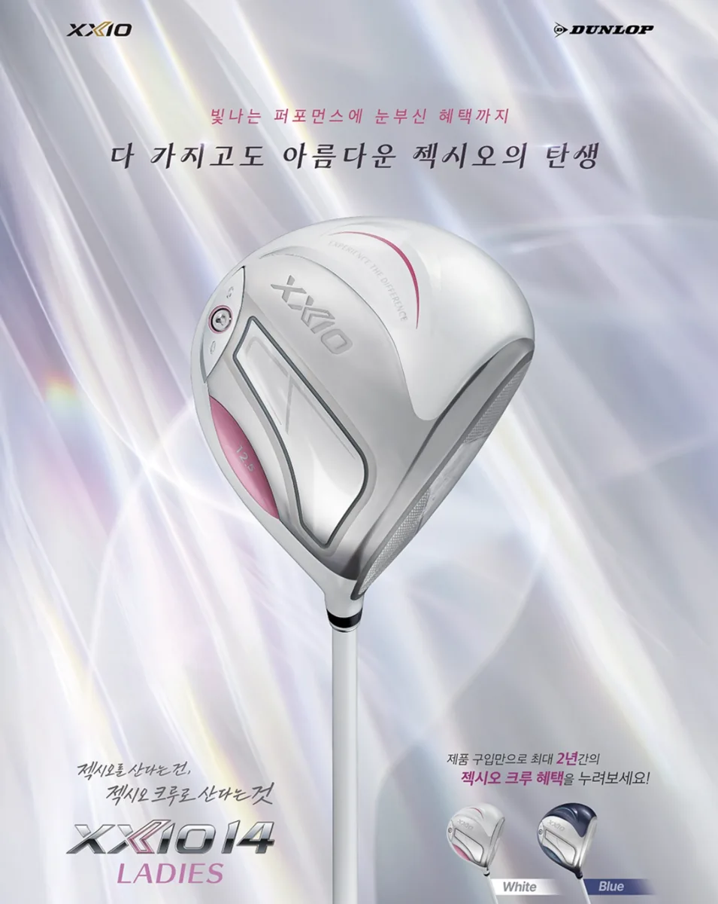
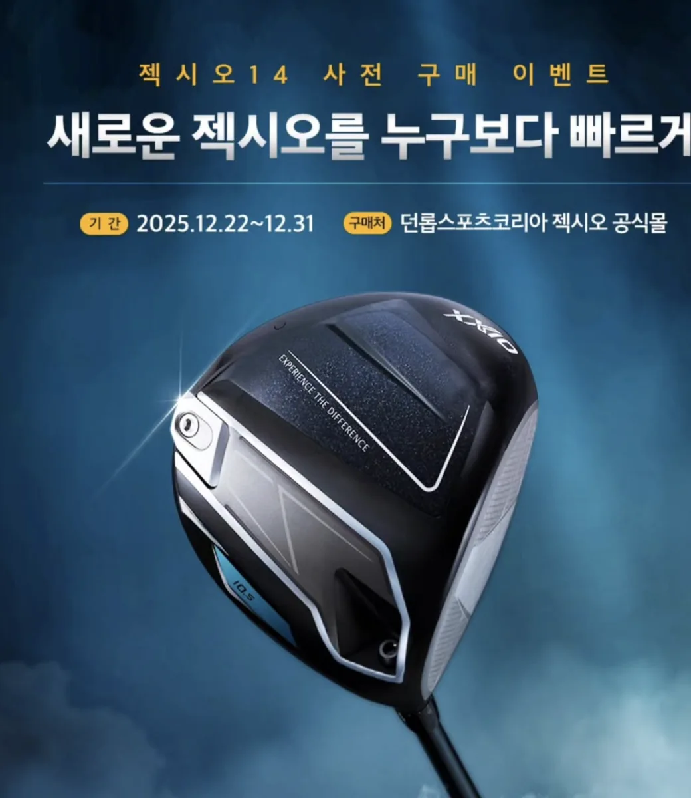
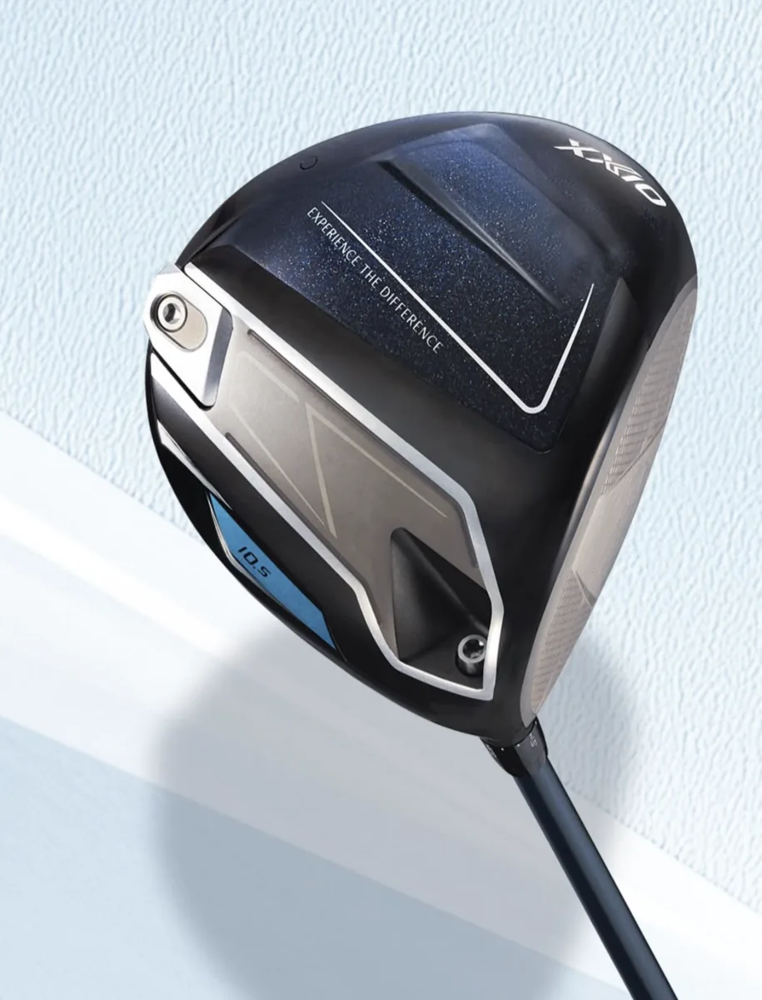

골프를 즐기다 보면 피할 수 없는 상황이 하나 있습니다. 바로 소중한 골프 클럽이 손상되거나 고장 나는 경우입니다. 특히 드라이버는 가장 자주 사용하는 클럽이면서도 충격에 민감한 장비여서 **헤드 파손**, **샤프트 결함**, **이상한 소리 발생** 등의 문제가 생길 수 있습니다. 라운딩 도중 드라이버 헤드에서 이상한 소리가 나기 시작해 급하게 수리 방법을 찾으며 당황했던 경험이 많은 골퍼들에게 있을 것입니다.

다행히 **젹시오(XXIO)**는 일본의 대표적인 골프 브랜드로 국내에서도 공식 AS 센터를 운영하고 있습니다. 하지만 처음 AS를 신청해 보는 사람들은 어디로 연락해야 하고, 어떤 절차를 거쳐야 하는지 막막할 수 있습니다. 오늘은 젹시오 드라이버 AS 센터 접수 방법부터 고객센터 전화번호, 센터 위치, 무상·유상 수리 조건까지 **모든 정보를 정리**해드리겠습니다.

---

## 젹시오 고객센터 전화번호 및 운영 정보

가장 먼저 알아야 할 정보는 **공식 고객센터 연락처**입니다. 젹시오 골프 장비의 국내 공식 수입원은 **던롭스포츠코리아**이므로 이곳을 통해 AS를 진행해야 합니다.

**젹시오 공식 고객센터 연락처 안내**

젹시오 공식 고객센터의 전화번호는 **02-3462-3960**입니다. 평일에는 오전 9시부터 오후 6시까지 운영하며, 토요일은 오전 9시부터 오후 5시까지 상담을 받을 수 있습니다. 일요일과 공휴일은 휴무이므로 이 점을 참고하여 연락하시기 바랍니다.

**효율적인 상담 시간대 안내**

점심시간인 오후 12시부터 1시 사이에는 상담원 연결이 지연될 수 있으므로 이 시간을 피해 전화를 거는 것이 좋습니다. 만약 대기 시간이 길다면 **오전 9시 30분부터 11시 30분 사이** 또는 **오후 2시부터 5시 사이**에 전화하는 것을 권장합니다. 이 시간대에 전화하면 상담원 대기 시간이 짧아 보다 신속한 상담을 받을 수 있습니다.

---

## 젹시오 AS 센터 위치 및 방문 안내

직접 드라이버를 가지고 가서 상태를 점검받고 싶다면 본사 AS 센터를 방문할 수 있습니다. 하지만 **방문 접수는 제한되어 있으니** 먼저 전화로 확인하는 것이 좋습니다.

**젹시오 AS 센터 위치 정보**

젹시오 AS 센터는 서울특별시 서초구 사평대로 76 로지트빌딩 지하 1층에 위치하고 있습니다. 강남역 인근 반포동에 자리하고 있으며 강남역에서 도보로 접근할 수 있습니다.

**방문 접수 유의사항**

2021년 7월 1일부터 본사 방문 AS 접수는 **원칙적으로 운영하지 않습니다**. 다만 제품 상태를 직접 확인받고 싶다면 **미리 전화로 예약**한 후 방문하면 전문가가 확인해 줄 수 있습니다. 방문 전에 반드시 전화로 대기 시간과 상담 가능 시간을 확인하는 것이 중요합니다. 예약 없이 방문하면 상담을 받지 못할 수 있으므로 주의하시기 바랍니다.

---

## 젝시오 드라이버 AS 접수 방법

AS 접수는 3가지 방법으로 진행할 수 있습니다. 각 방법의 특징을 파악하고 본인에게 맞는 방식을 선택하세요.

**구입처(특약점)를 통한 접수**

드라이버를 구입한 골프 용품점이나 매장에서 직접 AS 접수가 가능합니다. 구매처를 알고 있다면 먼저 그곳에 연락하여 AS 절차를 문의하는 것이 가장 간편합니다. 구입처에서 친숙한 상담원을 통해 접수하면 추가 설명 없이도 절차가 빠르게 진행될 수 있습니다.

**택배를 이용한 원격 접수 (가장 일반적)**

대부분의 고객들이 이 방법을 선택합니다. 전국 어디서나 물건을 보낼 수 있어 편리합니다. 택배 발송 주소는 서울특별시 서초구 사평대로 76 로지트빌딩 지하 1층 (던롭스포츠코리아)입니다.

택배 접수 절차는 다음과 같습니다. 먼저 고객센터 전화(02-3462-3960)로 AS 신청 의사를 전달합니다. 고장 증상을 상세히 설명하고, 예를 들어 헤드 파손, 소리 발생, 샤프트 흠집 등을 구체적으로 설명합니다. 상담원의 안내를 받은 후 드라이버를 포장합니다. 메모지에 본인의 성함과 연락처, 구체적인 고장 증상, 구매 영수증 정보를 적어 동봉합니다. 드라이버는 충격에 약하므로 완충재를 충분히 넣어 포장하고 택배로 발송합니다. 발송 비용은 고객 부담입니다.

**중요 주의사항**: 반드시 **드라이버 전체(헤드 + 샤프트)**를 함께 보내야 합니다. 헤드나 샤프트 중 하나만 보내면 AS 접수가 불가능하므로 이 점을 꼭 기억하세요.

**온라인 사전 접수**

던롭스포츠코리아 공식 웹사이트에서 **온라인 사전 접수**를 할 수 있습니다. 웹사이트 주소는 dunlopsportskorea.co.kr/as이며, 빠른 접수와 자동 택배 예약이 가능한 장점이 있습니다. 온라인 양식을 작성하면 자동으로 택배 픽업이 안내되어 매우 편리합니다.

---

## 젹시오 드라이버 무상 AS 조건

AS를 받기 전에 가장 먼저 확인해야 할 것이 **무상 보증 기간**입니다. 보증 기간 내라면 수리 비용 없이 무상 수리를 받을 수 있습니다.

**무상 AS 보증 기간 안내**

일반 제품은 구매일 기준 **2년** 동안 무상 보증을 받습니다. 단종 제품이나 할인판매 제품의 경우 구매일 기준 **1년**의 무상 보증이 적용됩니다. 보증 기간을 확인할 때는 반드시 **구매 영수증**을 준비해야 합니다.

**무상 AS가 적용되지 않는 경우**

다음의 경우에는 보증 기간 내라도 무상 AS가 적용되지 않습니다. **정품 등록이 안 된 제품**은 무상 보증을 받을 수 없으며, 반드시 공식 정품이어야 합니다. **해외 직구 제품**이나 **병행 수입 제품**은 국내에서 구입하지 않은 물건이므로 무상 AS 대상이 아닙니다. **사용자 과실로 인한 파손**은 무상 보증이 적용되지 않으며, 외부 충격이나 낙하로 인한 손상이 여기에 해당합니다. **그립 교체**와 같은 **소모품 교체**도 무상 보증 대상이 아닙니다.

**무상 AS 주의사항**

무상 AS를 받았다고 해서 **보증 기간이 연장되지 않습니다**. 제품 구매일이 명확하지 않으면 **구매 영수증 제출이 필수**입니다. 증빙이 불가능하면 **바코드상 출고일 기준**이 적용됩니다. **시타 클럽(중고 클럽)**은 무상 보증 기간이 적용되지 않으므로 구매처 확인 시 신품 구매 여부를 명확히 하세요.

---

## 젝시오 드라이버 유상 AS 안내

보증 기간이 지나거나 사용자 과실로 인한 손상인 경우 **유상 AS**가 적용됩니다.

**유상 AS가 적용되는 구체적인 경우**

샤프트 파손의 경우 스윙 방향과 다른 방향으로 파손되거나 내부 녹이 발생한 상황이 유상입니다. 헤드 파손으로 볼 외 물체 충격, 페이스 상처, 함몰이 있는 경우도 유상이며, 과도한 도색 손상으로 큰 기스, 벗겨짐, 도금 손상이 있으면 유상입니다. 관리 부주의로 인한 녹이나 표면 기스로 인한 녹도 유상 대상이며, 무게나 길이 변경이 필요한 경우, 그립 교체와 같은 소모품 교체, 타사 부품 접착이나 개조된 클럽도 유상 AS에 해당합니다.

**유상 AS의 특별한 장점**

유상 AS를 받으면 **동일 부위에 대해 1년간 무상 보증**이 새로 적용됩니다. 예를 들어 2024년 7월에 샤프트를 유상 수리했다면, 같은 부위는 2025년 7월까지 무상 수리 가능합니다. 이는 수리 후 문제가 재발했을 때 추가 비용 없이 대응받을 수 있다는 의미이므로 고객 입장에서 매우 유리합니다.

**유상 수리 절차 및 진행 방식**

유상 수리를 받으려면 먼저 고객센터로 전화하여 대략적인 **견적을 확인**해야 합니다. 수리 비용에 동의하면 요청된 금액을 **입금**한 후 수리가 시작됩니다. 수리 완료 후 **택배로 발송**되며 반송 비용은 고객 부담입니다. **받은 후 즉시 시타**해서 정상 작동을 확인하는 것이 좋습니다.

---

## 정품 확인 및 AS 불가 제품

[젝시오 Instagram](https://www.instagram.com/xxio_korea/)

AS를 받기 위한 가장 중요한 조건은 **정품 확인**입니다.

**정품 확인 방법**

드라이버 샤프트에 부착되어 있는 **정품 홀로그램 스티커**로 정품을 확인할 수 있습니다. 드라이버 헤드에 각인되어 있는 **일련번호**도 정품 판별의 중요한 요소입니다. dunlopsportskorea.co.kr 웹사이트에서 **정품 등록**을 확인할 수도 있습니다.

**AS를 받을 수 없는 제품의 종류**

해외 직구로 구입한 제품은 AS 대상이 아닙니다. 던롭을 통하지 않은 병행 수입 제품도 마찬가지이며, 가품이거나 정품 스티커가 훼손된 제품, 정품 스티커가 제거된 제품도 AS를 받을 수 없습니다. 타사 부품이 섞여 있는 개조품도 AS 대상이 아니므로 주의하세요.

---

## 젝시오 AS 현황 조회 및 수령 방법

접수된 드라이버가 현재 어떤 단계에 있는지 확인할 수 있습니다.

**AS 현황 조회 방법**

**웹사이트 조회**: dunlopsportskorea.co.kr/as의 "현황 조회" 메뉴에서 자신의 접수 정보를 입력하면 현재 상태를 확인할 수 있습니다. **전화 조회**: 02-3462-3960으로 전화하여 상담원에게 직접 문의할 수도 있습니다. 상담원은 빠르게 접수 현황을 확인하고 예상 완료 시간을 알려줄 것입니다.

**수리 완료 후 수령 방법**

**센터 수령**: 직접 방문하여 픽업할 수 있습니다. **택배 수령**: 안전하게 재포장되어 발송되며 반송 비용은 고객 부담입니다. **수령 후 확인**: 즉시 시타해서 이전의 문제가 해결되었는지 확인하는 것이 좋습니다.

**보관 기간 주의사항**

접수센터에 도착한 클럽은 **1개월까지만 보관**됩니다. 1개월이 지나면 분실이나 파손에 대한 책임이 없으니 수리 완료 후 빨리 수령해야 합니다. 긴 여행이나 출장이 예정되어 있다면 사전에 상담원에게 알려 보관 연장이 가능한지 확인하세요.

---

## 젹시오 AS 신청 전 최종 체크리스트

AS를 신청하기 전에 다음 사항들을 확인하면 불필요한 지연을 방지할 수 있습니다.

**필수 준비물 확인**

구매 영수증을 준비하세요. 보증 기간 확인을 위해 필수입니다. 드라이버 전체(헤드와 샤프트 모두)를 포장하세요. 정품 스티커를 확인하여 정품인지 확인하세요. 메모지에 고장 증상을 상세하게 작성하여 동봉하세요.

**택배 발송 시 최종 확인**

완충재를 충분히 넣어 포장했는지 확인하세요. 드라이버가 배송 중 손상될 수 있기 때문에 중요합니다. 드라이버 헤드와 샤프트가 모두 들어 있는지 다시 한 번 확인하세요. 메모지에 본인 정보와 고장 증상을 정확하게 적었는지 확인하세요. 구매 영수증을 동봉했는지 확인하세요. 올바른 주소(서초구 사평대로 76)로 발송하는지 최종 확인하세요.

---

## 결론

소중한 골프 클럽인 **젝시오 드라이버**가 손상되었다면 **공식 AS 센터**를 통해 전문가의 손길을 받는 것이 가장 안전합니다. 비용 부담 없이 **2년간 무상 보증**을 받을 수 있으며, 보증 기간이 지나서도 **합리적인 비용으로 전문적인 수리**가 가능합니다.

더 빠른 접수를 원한다면 **온라인 사전 접수**를 추천하며, 직접 상담받고 싶다면 **02-3462-3960**으로 전화하세요. 평일 오전 9시부터 오후 6시까지, 토요일 오전 9시부터 오후 5시까지 친절한 상담을 받을 수 있습니다. 본 글에서 제공한 정보를 참고하여 체계적으로 AS를 진행하면 최상의 결과를 얻을 수 있을 것입니다.

지금 바로 연락하여 당신의 젹시오 드라이버를 **최상의 상태로 복원**해 보세요!

---

#젹시오 #골프클럽 #AS센터 #드라이버수리 #고객센터 #던롭스포츠코리아 #골프용품젝
