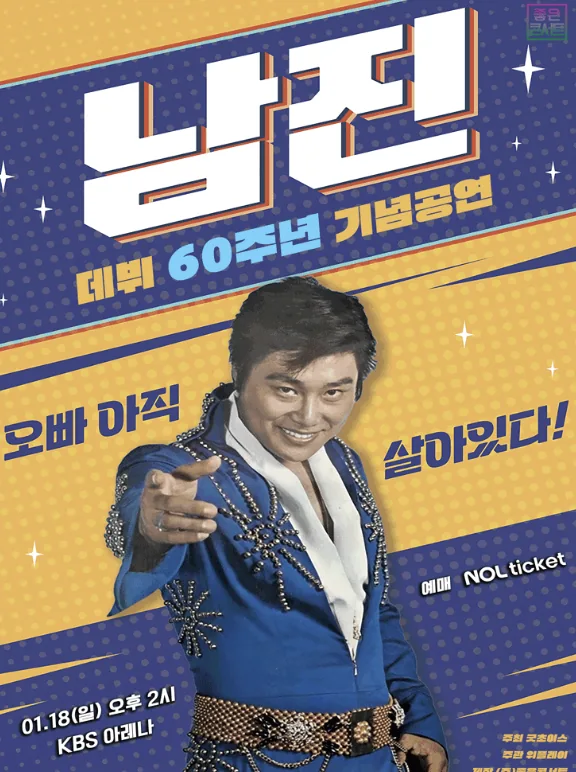

**SBS 예능 '내겐 너무 까칠한 매니저 - 비서진'**이 이번에는 대한민국 가요계의 살아있는 전설을 만난다. 배우 **이서진**이 '꽃할배 수발 전문가'로서의 면모를 드러내며 81세 가수 **남진**의 **데뷔 60주년 전국 투어 콘서트**를 수발하는 특별한 에피소드가 예정되어 있습니다. 1970년대 '한국의 엘비스 프레슬리'로 불렸던 남진과 현 세대의 '도련님' 이서진이 마주하는 순간, 어떤 감정의 교감이 일어날까요? 본 가이드에서는 방송 정보와 남진의 위상, 그리고 이서진의 활약상을 완벽하게 정리했습니다.

## 프로그램 기본 정보 - 내겐 너무 까칠한 매니저 - 비서진

**프로그램명**: 내겐 너무 까칠한 매니저 - 비서진 (My Grumpy Secretary)
**방송국**: SBS (넷플릭스 동시 스트리밍)
**방송 일정**: 2026년 1월 16일 금요일 오후 11시 10분 (본방송)
**진행자**: 이서진, 김광규
**특별 출연**: 남진 (가수, 81세)

본 에피소드는 **'비서진'** 시리즈 중 가장 높은 연령대 스타가 등장하는 특별 방송으로, 팬들 사이에서도 상당한 기대감이 모아지고 있습니다. 이전 에피소드들이 높은 시청률과 화제성을 기록한 만큼 이번 남진 편도 큰 관심을 받을 것으로 예상됩니다.

## '꽃할배 수발 전문' 이서진의 매력

**이서진**은 '꽃할배'라는 애정 어린 별명으로 불리며 예능에서 자신의 독특한 매력을 드러내고 있습니다. 평소 남에게 무심해 보이던 그가 선배나 출연자를 위해서라면 손을 직접 마사지해주고, 옷매무새를 정돈해주며 정성스러운 수발을 펼친다고 알려져 있습니다.

이서진은 현대 드라마와 예능에서 '까칠한 도련님', '고집 센 주인공' 같은 역할로 유명하지만, **'비서진'**이라는 프로그램을 통해 다른 한편의 매력을 보여주고 있습니다. 특히 선배를 대하는 그의 진정성 있는 태도는 많은 시청자들에게 호감을 사고 있습니다. 남진과의 만남에서 이서진이 얼마나 정성스러운 수발을 펼칠지 기대되는 부분입니다.

## 영원한 전설, 남진의 60년 가요사

**남진**은 1970년대를 대표하는 '한국의 엘비스 프레슬리'**입니다. 현재 81세의 나이에도 불구하고 여전히 활발하게 음악 활동을 이어가고 있는 최고령 현역 가수**로 알려져 있습니다.

남진의 음악 경력을 돌아보면, 1960년대 후반부터 시작된 그의 가요사는 한국 대중음악의 변화를 함께 겪어온 **산증인**입니다. 특히 **1970년대**에는 시대를 앞서간 퍼포먼스와 폭발적인 에너지로 수많은 팬들을 사로잡았으며, 이는 당시 한국 가요계에서 전무후무한 현상이었습니다.

데뷔 **60주년**을 맞은 남진은 현재 **전국 투어 콘서트**를 진행 중입니다. 80대의 나이에도 **무대 위에서 직접 노래하고 춤을 추는** 모습은 많은 이들에게 감동을 주고 있으며, 그의 음악이 지닌 시대적 의미와 영원한 생명력을 증명하고 있습니다.

## 세대를 초월한 두 '도련님'의 만남

예능 팬들 사이에서 주목하는 포인트는 바로 **이서진**과 **남진**이라는 두 세대의 '도련님' 이미지의 충돌과 조화입니다.

**이서진**은 현 세대의 드라마와 예능에서 '도련님' 캐릭터로 자주 등장하며, 그의 무뚝뚝하면서도 따뜻한 매력이 팬들을 매료시키고 있습니다. 반면 **남진**은 '**원조 도련님**'으로 불리며, 1970년대 당시 그의 세련되고 우아한 이미지는 많은 여성 팬들의 우상이었습니다.

이 두 세대의 '도련님'이 만나는 순간, 어떤 화학 반응이 일어날지는 매우 흥미로운 지점입니다. 예고편에서는 **이서진이 남진을 위해 정성스럽게 수발**을 드리는 장면과 **남진이 자신의 노래를 열창하는 장면**, 그리고 그것을 보고 **김광규의 눈물이 흐르는 장면**이 담겨 있어, 단순한 예능이 아닌 **세대 간의 감정적 교감**이 담긴 특별한 에피소드임을 시사하고 있습니다.

## 남진 콘서트 투어와 81세의 도전

[남진 콘서트 티켓 정보](https://tickets.interpark.com/goods/25017392)

**남진의 데뷔 60주년 전국 투어 콘서트**는 단순한 예능 소재를 넘어 **세대와 시대를 초월한 음악의 힘**을 보여주는 사건입니다.

81세의 나이에 **전국을 돌아다니며 직접 무대에서 노래하고 춤을 추는** 남진의 활동은 다음과 같은 의미를 담고 있습니다:

**음악의 영원성**: 60년 전 만들어진 남진의 노래들이 여전히 많은 세대에게 사랑받고 있다는 것은 음악의 영원한 가치를 증명합니다. 1970년대의 사랑 노래, 트로트, 그리고 팝 풍의 곡들이 현 시대에도 여전히 감동을 주고 있습니다.

**세대 간의 교량**: 60세 이상의 팬들뿐만 아니라 젊은 세대도 남진의 콘서트에 찾아가고, 그의 노래에 감정을 나누고 있습니다. 이는 음악이 세대를 초월한 보편적 감정을 담고 있음을 보여줍니다.

**건강한 노년의 모델**: 활발한 음악 활동으로 자신의 생명력을 증명하는 남진의 모습은 많은 이들에게 건강하고 아름다운 노년의 롤모델이 되고 있습니다.

## 예고편 속 감동의 순간들

공개된 예고편에서 눈에 띄는 순간들은 다음과 같습니다:

**이서진의 정성스러운 수발**: 남진의 옷매무새를 정돈해주고, 무대 리허설 중에도 옆에서 챙기는 이서진의 모습이 담겨 있습니다. 평소 무뚝뚝해 보이는 이서진이 선배를 위해 펼치는 섬세한 배려가 예능의 감동 포인트입니다.

**남진의 열창**: 무대 위에서 자신의 대표곡들을 열정적으로 부르는 남진의 모습은 나이를 무색하게 합니다. 그의 목소리와 퍼포먼스 속에는 60년 가요사의 무게와 자부심이 담겨 있습니다.

**김광규의 눈물**: 남진의 노래를 듣고 눈물을 흘리는 김광규의 장면은 단순한 예능을 넘어 **인생의 무게를 함께 나누는 순간**임을 보여줍니다. 이는 음악과 나이, 세대, 그리고 인생이라는 보편적 주제에 대한 깊은 성찰을 담고 있습니다.

## 시청 정보 및 추천 포인트

**방송 채널**: SBS (TV 및 SBS 다시보기)
**스트리밍**: 넷플릭스에서 동시 공개 예정
**방송 시간**: 매주 금요일 밤 11시 10분
**런타임**: 약 60~90분

## 결론

**'비서진' 남진 편**은 단순한 예능 프로그램을 넘어 **60년 음악 경력의 무게**, **세대 간의 소통과 교감**, 그리고 **아름다운 나이 듦**에 대한 깊은 성찰을 담고 있는 특별한 방송이 될 것으로 예상됩니다.

'**꽃할배 수발 전문**' 이서진이 '**원조 도련님**' 남진을 만나는 순간, 그리고 81세의 전설이 무대 위에서 자신의 인생을 노래하는 장면은 많은 시청자들의 가슴을 울릴 것입니다.

**2026년 1월 16일 금요일 밤 11시 10분**, SBS와 넷플릭스에서 방영되는 이 특별한 에피소드를 놓치지 마세요!

#비서진 #이서진 #남진 #SBS예능 #데뷔60주년 #꽃할배 #도련님 #세대간소통 #예능방송 #콘서트 #한국가요사 #감동예능 #내겐너무까칠한매니저
