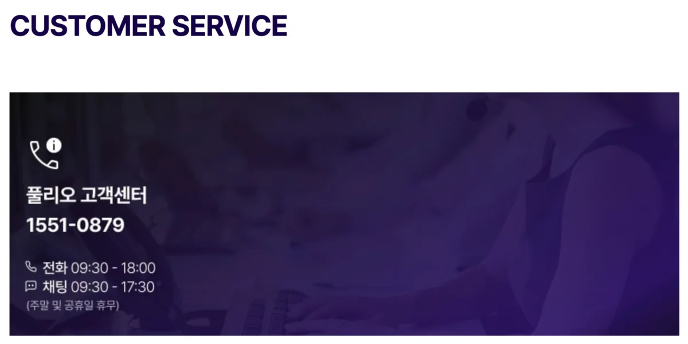
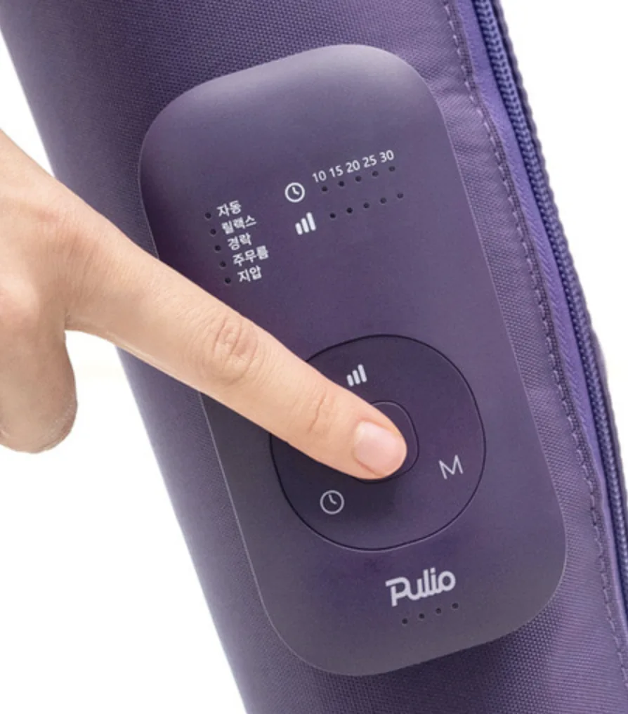
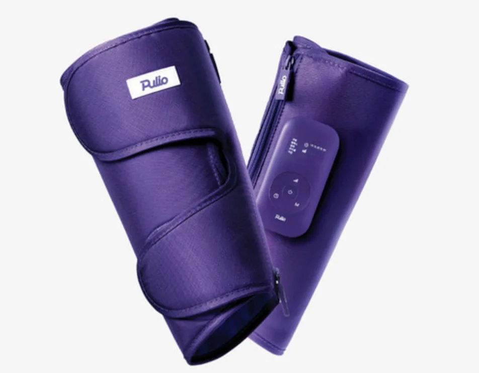

**풀리오(Pulio) 마사지기**는 종아리, 허벅지, 목과 어깨의 피로를 풀어주는 매우 편리한 프리미엄 가전제품입니다. 하지만 매일 사용하다 보면 **배터리 수명 저하**, **충전 불량**, **진동 기능 이상** 등의 문제가 발생할 수 있습니다. 저도 처음에는 갑자기 충전이 되지 않아 당황했던 경험이 있는데, 다행히 체계적인 고객센터 지원을 통해 문제를 신속하게 해결할 수 있었습니다.

풀리오는 기존 100일이었던 품질보증 기간을 **365일로 대폭 연장**하여 고객 만족도를 높이고 있습니다. 또한 AS 방식이 수리가 아닌 **새 제품 또는 리퍼 제품 교환**으로 이루어지기 때문에 더욱 빠르고 깔끔하게 문제를 해결할 수 있습니다. 오늘은 풀리오 마사지기 **AS 접수 방법**, **품질 보증 기간**, **교환 정책**, **소요 기간**까지 모든 정보를 정리해드리겠습니다.

[ 풀리오 고객센터 바로가기](https://puliodays.com/shopinfo/service_center.html)

## 풀리오 마사지기 공식 고객센터 연락처

가장 먼저 알아야 할 정보는 **정확한 고객센터 번호**입니다. 풀리오 공식 고객센터 대표번호는 **1551-0879**이며, 운영시간은 평일 오전 9시 30분부터 오후 6시까지입니다. 점심시간에는 상담이 어려울 수 있으므로, 가장 빠른 연결을 원한다면 **오전 9시 30분부터 12시 사이** 또는 **오후 2시부터 3시 사이**에 전화하는 것을 권장합니다. 토요일, 일요일, 공휴일은 휴무입니다.

전화 연결이 어려운 경우에는 **이메일(puliodays@gmail.com)**이나 **카카오톡 채팅**으로 더 편리하게 상담받을 수 있습니다. 카카오톡에서 "풀리오"를 검색하여 공식 채널을 추가한 후 채팅으로 문의하면 됩니다. 카카오톡 상담 운영시간은 평일 오전 9시 30분부터 오후 5시 30분까지이며, 24시간 메시지 접수가 가능하고 사진이나 영상을 첨부할 수 있어 문제 상황을 명확하게 전달할 수 있습니다.

## 풀리오 AS 접수 방법

풀리오 AS 접수는 **전화 접수**와 **카카오톡 접수** 두 가지 방법으로 진행할 수 있습니다. 전화로 접수할 경우 1551-0879로 전화를 걸어 문제 증상을 설명하고, 구매 정보(구매처, 주문 번호, 구매 날짜)를 제공하면 AS 접수가 완료됩니다. 이후 풀리오에서 지정한 택배사가 방문하여 제품을 수거합니다.

카카오톡으로 접수하는 방법이 더 편리할 수 있습니다. 카카오톡에서 풀리오 공식 채널을 추가한 후 "AS 신청" 또는 "교환·반품" 관련 문의를 시작하면 됩니다. 텍스트로 문제를 설명하면서 사진이나 영상을 함께 첨부할 수 있어 상태를 명확하게 전달할 수 있고, 채팅 내용이 기록으로 남아 나중에 참고하기도 좋습니다. 상담원이 확인 후 1~2시간 내에 답변을 받을 수 있으며, 운영시간 외에도 메시지를 남겨두면 다음 영업일에 처리됩니다.

**중요한 점**은 교환 및 반품 진행을 위한 택배 접수는 풀리오에서 직접 진행한다는 것입니다. 임의로 택배를 발송하면 분실 우려가 있고 처리가 불가할 수 있으므로, 반드시 고객센터를 통해 정식으로 접수한 후 안내에 따라 진행해야 합니다.

## 풀리오 마사지기 품질 보증 기간 안내

풀리오의 품질보증 기간은 구매일로부터 365일(1년)입니다. 기존에는 100일이었으나 현재는 365일로 연장되어 더욱 안심하고 사용할 수 있습니다. 보증 기간 내에 제품 하자가 인정되면 무상으로 교환 서비스를 받을 수 있으며, 보증 기간이 지난 후에는 유상 비용이 발생합니다.

구매 후 7일 이내에 제품 하자로 교환을 요청하면 **새 제품으로 교환**받을 수 있습니다. 8일부터 365일 이내에 교환을 요청하면 제품 하자로 인정될 경우 **리퍼 제품으로 교환**됩니다. 365일이 초과된 후에는 제품 하자로 인정되더라도 **유상 비용이 발생**하며, 리퍼 제품으로 교환이 진행됩니다. 이 유상 교환은 **1회로 한정**됩니다. 하자로 인정되지 않는 경우에는 기간에 관계없이 제품이 반송되며 배송비는 고객 부담입니다.

무상 보증을 받기 위해서는 **구매 증빙 자료**가 필요합니다. 온라인 구매의 경우 주문 번호와 운송장 번호 등 구매 관련 자료가 필요하고, 오프라인 구매의 경우 구매 영수증이 필요합니다. 하자 내용 확인을 위한 사진이나 영상도 준비해두면 더욱 명확하게 접수할 수 있습니다. 이러한 자료가 준비되지 않은 경우에는 서비스 제한이 있을 수 있으니 구매 증빙을 잘 보관해두시기 바랍니다.

## 무상 교환 대상과 유상 교환 대상

풀리오 AS는 **수리가 아닌 교환 방식**으로 이루어집니다. 따라서 제품에 문제가 있으면 수리를 받는 것이 아니라 새 제품 또는 리퍼 제품으로 교환받게 됩니다. 무상 교환이 적용되는 경우는 정상적인 사용 중 발생한 **배터리 수명 저하**, **충전 불량**, **진동 기능 이상**, **전원 작동 불량**, **메인 보드 고장**, **모터 작동 불량** 등 제조상의 결함으로 인한 하자입니다.

반면 **사용자 과실로 인한 손상**은 유상 처리 대상입니다. 제품을 떨어뜨렸거나 침수되었거나, 고의적으로 분해를 시도했거나, 충격으로 인해 파손된 경우가 이에 해당합니다. 또한 지나친 힘으로 조작하거나 극한의 온도 환경에서 사용하거나 제조사 미승인 부품을 사용한 경우도 정상 사용 범위를 벗어난 것으로 판단되어 유상 처리될 수 있습니다. 부품만 별도로 구매하는 것은 불가능하며, 자체적으로 제품을 분해하거나 재조립하는 경우 서비스 제한이 있을 수 있으니 주의해야 합니다.

## 풀리오 AS 소요 기간

풀리오 AS의 전체 소요 기간은 **본사 수령일로부터 최대 10영업일 이내**입니다. 고객센터에 접수하면 당일 상담이 완료되고, 택배 수거까지 1~2일이 소요됩니다. 제품이 본사에 입고되면 AS팀에서 제품을 검수하여 하자 여부를 판단하는데, 이 검수 및 처리 과정이 최대 10영업일 이내에 완료됩니다. 검수 결과에 따라 교환이 결정되면 새 제품 또는 리퍼 제품이 발송되며, 재배송까지 1~2일이 추가로 소요됩니다.

따라서 전체적으로 접수부터 제품 수령까지 약 **7~14영업일** 정도를 예상하면 됩니다. 주말과 공휴일은 영업일에서 제외되므로, 휴가철이나 명절 전후로는 물량이 몰려 기간이 다소 늘어날 수 있습니다. 진행 상황은 카카오톡 알림톡을 통해 실시간으로 확인할 수 있어 편리합니다. 알림톡을 받지 못한 경우에는 카카오톡 채팅이나 전화로 직접 문의하면 됩니다.

## 오프라인 서비스 센터 및 기타 안내

풀리오의 모든 제품 AS는 **고객센터 및 온라인으로만 진행**되며, 오프라인 AS 서비스는 제공하지 않습니다. 따라서 직접 방문하여 수리를 받는 것은 불가능하고, 반드시 고객센터를 통해 접수한 후 택배로 제품을 보내야 합니다. 다만 풀리오는 스타필드 고양점, 공덕 체험존, 신세계백화점 등 여러 오프라인 매장을 운영하고 있어 제품을 직접 체험해보고 구매할 수는 있습니다.

**다른 모델로 변경은 불가능**하며, 동일한 제품으로만 교환이 가능합니다. 선물받은 제품도 AS가 가능한데, 선물을 주신 분의 주문자 정보 조회를 통해 주문 이력이 확인되는 경우에 한합니다. 소모품을 분실한 경우에는 풀리오 자사몰에서 소모품 및 구성품을 구매할 수 있으며, 그 외 제품에 대한 구성품 구매는 고객센터를 통해 문의하면 됩니다.

## 자가 점검 방법

AS 접수 전에 간단한 자가 점검으로 문제가 해결될 수도 있습니다. 전원이 켜지지 않는 경우에는 충전 케이블을 다른 것으로 교체해보거나, 전원 버튼을 10초 이상 길게 눌러 리셋을 시도해보세요. 충전 포트에 이물질이 끼어있는지도 확인해보시기 바랍니다. 배터리가 빨리 닳는 경우에는 배터리를 완전 방전한 후 완전 충전하는 과정을 반복해보고, 습기가 많은 환경에서 제품을 보관하지 않도록 주의하세요.

진동이 약해진 경우에는 벨크로 부분에 이물질이 있는지 확인하고, 점착력이 약해졌다면 가볍게 문질러 되살려보세요. 소음이 나는 경우에는 내부에 물이 들어갔는지, 제품이 단단한 표면에 닿고 있지 않은지 확인해보시기 바랍니다. 이러한 방법으로도 해결되지 않으면 고객센터에 AS를 접수하는 것이 좋습니다.

## 풀리오 제품 보관 팁

고장을 예방하고 제품 수명을 연장하기 위한 관리 방법도 알아두면 좋습니다. 배터리 수명을 유지하려면 한 달에 한 번 정도 완전히 충전하여 방전을 방지하고, 완전히 방전된 상태로 3개월 이상 방치하지 않는 것이 좋습니다. 추운 환경에서는 충전 전에 실온에서 데운 후 충전하는 것을 권장합니다.

습기로부터 제품을 보호하는 것도 중요합니다. 욕실이나 습기가 많은 환경에서는 사용과 보관을 피하고, 제품을 밀폐 용기에 보관하지 않는 것이 좋습니다. 충격으로부터 보호하기 위해 딱딱한 바닥에 떨어뜨리지 않도록 주의하고, 소프트 케이스에 보관하며, 장시간 사용 후에는 통풍이 잘 되는 곳에 두시기 바랍니다.

## 자주 묻는 질문

**구매한 시점을 정확히 모르는 경우에도 AS를 받을 수 있나요?** 온라인 구매였다면 주문 내역에서 구매 날짜를 확인할 수 있고, 오프라인 매장이었다면 영수증이나 신용카드 청구서로 증명할 수 있습니다. 증명이 어려운 경우에는 상담원에게 문의하면 도움을 받을 수 있습니다.

**유상 교환 견적을 받았는데 반드시 진행해야 하나요?** 아닙니다. 견적을 받은 후 교환 진행 여부를 자유롭게 선택할 수 있습니다. 비용이 부담스럽다면 교환을 진행하지 않고 제품을 반송받을 수도 있습니다.

**AS 중에 대체 제품을 받을 수 있나요?** 안타깝게도 대체 제품 제공은 없습니다. 전체적으로 7~14영업일 정도 소요되니 미리 계획을 세우시기 바랍니다.

**배터리만 따로 교체받을 수 있나요?** 부품만 별도로 구매하거나 교체받는 것은 불가능합니다. 풀리오 AS는 수리가 아닌 제품 교환 방식으로 진행되므로, 배터리 문제가 있다면 제품 전체 교환을 통해 해결됩니다.

## AS 접수 전 체크리스트

AS를 접수하기 전에 다음 사항을 미리 준비해두면 원활하게 진행할 수 있습니다. **구매 영수증 또는 주문 증명**(주문 번호, 운송장 번호 등)으로 구매일을 확인할 수 있어야 합니다. **제품 고장 증상**을 언제부터 어떤 증상이 나타났는지 명확하게 설명할 수 있도록 정리해두세요. **고장 상태를 보여주는 사진이나 영상**을 준비해두면 더욱 명확하게 접수할 수 있습니다. 그리고 AS 진행 중 연락받을 **현재 연락처**와 제품을 반송받을 **배송 주소**를 확인해두시기 바랍니다.

## 결론

**풀리오 마사지기 AS**는 매우 체계적이고 친절하게 진행됩니다. 고객센터 **1551-0879** 또는 **카카오톡 채팅**으로 편리하게 접수할 수 있으며, 본사 수령 후 최대 **10영업일 이내**에 검수 및 처리가 완료됩니다. 특히 AS 방식이 수리가 아닌 **제품 교환**으로 이루어지기 때문에 더욱 빠르고 깔끔하게 문제를 해결할 수 있습니다.

가장 중요한 것은 **구매 증빙을 잘 보관**하고, 문제가 생기면 **365일 보증기간 내에 빨리 상담**받는 것입니다. 지금 바로 **1551-0879로 전화**하거나 **카카오톡으로 상담**받으세요. 풀리오의 친절한 상담원이 문제를 신속하게 해결해드릴 것입니다.

---

#풀리오 #마사지기 #AS센터 #보증기간 #고객센터 #제품교환 #리퍼제품
